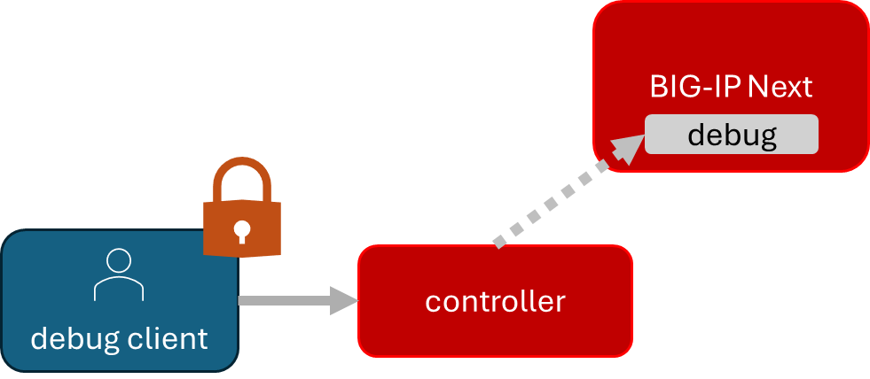
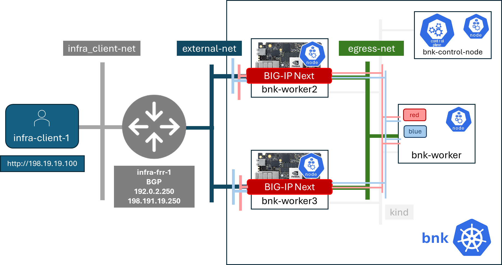

.. important:: We are taking you through a painful path to instruct. 

BIG-IP Next for Kubernetes in General Availability (GA) is organizing the installation into the Operator Lifecycle Manager (OLM) compliant operator you will see in these steps. 

*STAY CALM and Lab On!*

`Learn more about OLM Operators <https://olm.operatorframework.io/>`_

There are a couple of prerequisites for our lab we are going to install. 

Installing community services and resources
-------------------------------------------

First, for zero-trust communication between services, we will need a way to issue certificates.  There is a common open source component which is included in many Kubernetes distributions, but we will install it here. It is cert-manager.

.. image:: images/cert-manager.png

`Learn more about cert-manager <https://cert-manager.io/>`_

You will now run the below command to install cert-manager:

.. code-block:: bash
   :caption: Install Cert Manager

   ./create-cert-manager.sh

Your output should look like this:

.. code-block:: bash
   :caption: Cert Manager Output

   Install cert-manager and cluster issuer to manage pod-to-pod certs ...
   "jetstack" has been added to your repositories
   Release "cert-manager" does not exist. Installing it now.
   NAME: cert-manager
   LAST DEPLOYED: Fri Feb 6 07:28:10 2026
   NAMESPACE: cert-manager
   STATUS: deployed
   REVISION: 1
   TEST SUITE: None
   NOTES:
   cert-manager v1.16.1 has been deployed successfully!
   
   In order to begin issuing certificates, you will need to set up a ClusterIssuer
   or Issuer resource (for example, by creating a 'letsencrypt-staging' issuer).
   
   More information on the different types of issuers and how to configure them
   can be found in our documentation:
   
   https://cert-manager.io/docs/configuration/
   
   For information on how to configure cert-manager to automatically provision
   Certificates for Ingress resources, take a look at the `ingress-shim`
   documentation:
   
   https://cert-manager.io/docs/usage/ingress/
   pod/cert-manager-797c9cdb86-t975j condition met
   pod/cert-manager-cainjector-558fd876c9-m56h6 condition met
   pod/cert-manager-webhook-56d7979558-hmtvb condition met
   clusterissuer.cert-manager.io/selfsigned-cluster-issuer created
   certificate.cert-manager.io/bnk-ca created
   clusterissuer.cert-manager.io/bnk-ca-cluster-issuer created

We will install Prometheus and Grafana so we can collect metrics and look at some telemetry dashboards in the next lab. 

.. image:: images/Prometheus.png

`Learn more about Prometheus <https://prometheus.io/>`_

.. image:: images/Grafana.png

`Learn more about Grafana <https://github.com/grafana/grafana/blob/main/README.md>`_

We will create a certificate for the BIG-IP Next OTEL service so it can communicate securely.

.. image:: images/OpenTelemetry.png

`Learn more about OTEL <https://opentelemetry.io/>`_

All of these components are installed with the below script, please run:

.. code-block:: bash
   :caption: Deploy Gateway API and Telemetry

   ./deploy-telemetry.sh

Your output should look like this:

.. code-block:: bash
   :caption: Telemetry Output

   Install Promethues and Grafana ...
   certificate.cert-manager.io/prometheus created
   deployment.apps/prometheus created
   configmap/prometheus-config created
   service/prometheus-service created
   clusterrole.rbac.authorization.k8s.io/prometheus-default created
   clusterrolebinding.rbac.authorization.k8s.io/prometheus-default created
   deployment.apps/grafana created
   configmap/grafana-datasources created
   service/grafana created

   Install OTEL prerequired cert ...
   certificate.cert-manager.io/external-otelsvr created
   certificate.cert-manager.io/external-f5ingotelsvr created

Enable access to FAR
--------------------

It's time to download the BIG-IP Next for Kubernetes product.

Cloud native apps are downloaded from various software registries. The most familiar one was when docker introduced container orchestration 
to the world, `dockerhub <https://hub.docker.com>`_. Kubernetes distribution vendors maintain registries, like `Red Hat Quay <https://quay.io/>`_. 
The hyperscale cloud providers maintain their registries. 

Private corporate or product registries use mTLS based authentication and authorization to control access to software resources. 

F5 runs a artifact (containers images, orchestration files, manifest files for component versioning, utilities files) named creatively F5 Artifact Registry (FAR). In order to authenticate to FAR, we need certificate based credentials.

.. note:: How do you get FAR credentials?

We have written up how to get FAR credential for all BIG-IP Next products. The process is simple, but requires a login to `My F5 <https://my.f5.com>`_. 

`Read How to Download FAR credentials <https://clouddocs.f5.com/bigip-next-for-kubernetes/2.0.0-LA/far.html#download-the-service-account-key>`_

Because we can't be sure that everyone has access to *my.f5.com* already, we have copied the FAR authentication credentials to the 
lab virtual machine already and you can verify by running the list command:

.. code-block:: bash
   :caption: View FAR Credentials

   ls far/f5-far-auth-key.tgz

Verify output:

.. code-block:: bash
   :caption: View FAR Credentials Output

   far/f5-far-auth-key.tgz

We will add the credentials as a Kubernetes secret and then add FAR as a repository for Helm, the Kubernetes native package manager. 

`Learn more about Helm <https://helm.sh/>`_

We will now add the F5 Artifacts Registry and test our login with the below script command:

.. code-block:: bash
   :caption: Add FAR Registry

   ./add-far-registry.sh

Your output will look like this:

.. code-block:: bash
   :caption: Add FAR Registry and test Output

   ./add-far-registry.sh
   F5 Artifacts Registry (FAR) authentication token ...
   Create the secret.yaml file with the provided content ...
   secret/far-secret created
   secret/far-secret created
   Login Succeeded

Enable BIG-IP Next debug service access
---------------------------------------

We need to create a way for clients outside the cluster to create secured communications for debug services inside the cluster. This 
external access will allow you do get product information, do licensing reporting, collect qkviews for support, and have access to debug traffic.

These credentials will be stored in Kubernetes secrets, but we will also copy the credentials to files in the virtual machine host so we can 
use them for a demonstration an debug API access. We will do this in lab three.

We need to create these credentials before we install everything for BIG-IP Next for Kubernetes, please run the command:

.. code-block:: bash
   :caption: Install Cluster Wide Controller

   ./install-cwc.sh

Your output should look like this:

.. code-block:: bash
   :caption: Install Cluster Wide Controller Output

    Install Cluster Wide Controller (CWC) to manage license and debug API ...
    Pulled: repo.f5.com/utils/f5-cert-gen:0.9.3
    Digest: sha256:698ba32ae610751534f86d0fe4b78e620093bd3283d769d89295f56bbf1e9079
    Error: failed to untar: a file or directory with the name /home/ubuntu/cwc/f5-cert-gen already exists
    mv: cannot overwrite '/home/ubuntu/cwc/cert-gen/f5-cert-gen': Directory not empty
    ~/cwc ~
    ------------------------------------------------------------------
    Service                   = api-server
    Subject Alternate Name    = f5-spk-cwc.cne-core
    Working directory         = /home/ubuntu/cwc/api-server-secrets
    ------------------------------------------------------------------
    Generating Secrets ...
    ...
    Copying secrets ...
    Generating /home/ubuntu/cwc/cwc-license-certs.yaml
    Generating /home/ubuntu/cwc/cwc-license-client-certs.yaml
    ~
    secret/cwc-license-certs created
    Create directory for API client certs for easier reference ...
    ~/cwc ~
    ~
    
    Adding name for CWC service name for client access ...
    172.18.0.2  f5-spk-cwc.cne-core

That's the last prerequisite environment resource we need. Let's install BIG-IP!

Install a BIG-IP Next for Kubernetes deployment
-----------------------------------------------

We will use Helm to install our OLM compliant operator which will then orchestrate dynamically the lifecycle of the BIG-IP Next for Kubernetes 
components. That's why operators are cool. They are orchestrators which run constantly in your Kubernetes clusters doing their job for you.

Let's run the script for installation:

.. code-block:: bash
   :caption: Install BIG-IP Next for Kubernetes

   ./install-bnk.sh

Installation output:

.. code-block:: bash
   :caption: Install BIG-IP Next for Kubernetes Output

   Install BNK ...
   configmap/f5-tmm-dynamic-routing-template created
   node/bnk-worker2 labeled
   node/bnk-worker3 labeled

   taint bnk-worker2 and bnk-worker3 to make them explicitly dedicated to TMM
   node/bnk-worker2 tainted
   node/bnk-worker3 tainted

   disable tx checksum on vxlan interfaces

   bnk-worker2

   bnk-worker4

   bnk-worker

   bnk-worker3
   ...
   
   Release "flo" does not exist. Installing it now.
   Pulled: repo.f5.com/charts/f5-lifecycle-operator:v2.9.27-0.2.10
   Digest: sha256:8feeb375e1681c7b46baaebf0ecab043989b8e5c7f9747015b26b463621a4e5c
   NAME: flo
   LAST DEPLOYED: Fri Feb  6 23:37:53 2026
   NAMESPACE: cne-core
   STATUS: deployed
   REVISION: 1
   DESCRIPTION: Install complete
   TEST SUITE: None
   pod/flo-f5-lifecycle-operator-6669f6ccf7-msvmf condition met

   Install CNI instance for Kubernetes ...
   cneinstance.k8s.f5.com/bnkgatewayclass-sample created
   pod/flo-f5-lifecycle-operator-6669f6ccf7-msvmf condition met
   
It will take approximately 5 minutes for BNK to install within the cluster.  You can manually check the status by running:

.. code-block:: bash
   :caption: Check BNK Install Status
   kubectl get pods -n bnk-app

When BNK is fully installed you should see two pods named f5-tmm that are in the running state:

.. code-block:: bash
   :caption: BNK Pod Output
   NAME                                 READY   STATUS    RESTARTS   AGE
   f5-afm-579bc64c84-gjtcz              1/1     Running   0          3m45s
   f5-cne-controller-6d488df544-dxgq8   4/4     Running   0          3m44s
   f5-downloader-f67bc64fc-hspvg        2/2     Running   0          3m44s
   f5-dssm-db-0                         2/2     Running   0          3m45s
   f5-dssm-db-1                         2/2     Running   0          2m48s
   f5-dssm-db-2                         2/2     Running   0          2m10s
   f5-dssm-sentinel-0                   2/2     Running   0          3m45s
   f5-dssm-sentinel-1                   2/2     Running   0          2m42s
   f5-dssm-sentinel-2                   2/2     Running   0          116s
   f5-tmm-qjx94                         6/6     Running   0          3m44s
   f5-tmm-tzvg5                         6/6     Running   0          3m44s

Wait for the f5-tmm pods to be in a Running state before proceeding.

Next verify that BNK has a valid license:

.. code-block:: bash
   :caption: Verify BNK License
   ./check-cwc-lic.sh

The output should look similar to:

.. code-block:: yaml
   :caption: License Output
   
   Status: '{ 
      ClusterDetails: '{
         "Name": "My Cluster"
      }',
      LicenseDetails: '{
         "DigitalAssetID": "17430375-1058-4eda-bb9e-c0785fb75acf",
         "EntitlementType": "paid",
         "LicenseExpiryDate": "2026-08-05T23:41:29Z",
         "LicenseExpiryInDays": "179"
      }',
      LicenseStatus: '{
         "State": "Verification Complete"
      }' 
   },
   TelemetryStatus: '{
      "NextReport": '{
         "StartDate": "2026-02-07 23:41:41 +0000 UTC",
         "EndDate": "2026-02-28 23:41:41 +0000 UTC",
         "State": "Telemetry In Progress"
      }'
   }

Wow.. label nodes for BIG-IP Next installation.. install the orchestration.. BOOM.. Install. 

.. image:: images/BIG-IPInstalledLabEnvironment.png

Class Discuss: BIG-IP Next for Kubernetes on NVIDIA DPU nodes
-------------------------------------------------------------

In the above installation we labeled two nodes and pretty much dedicated these nodes to BIG-IP Next. We don't need to do this, but this illustrates how a NVIDIA DPUs would look. 

When you enable the NVIDIA BlueField-3 in DPU mode, it shows up as a separate node in your cluster. We label those nodes the same way we did in our install and the operator does the install as it would.

Create Kubernetes tenant networks for ingress and egress
--------------------------------------------------------

You will now create the tenant networks for the blue and red tenants by running:

.. code-block:: bash
   :caption: Create Tenant Networks

   ./create-tenants.sh

Viewed output:

.. code-block:: bash
   :caption: Tenant Networks Output

   Create red tenant namespace...
   namespace/red created
   
   Create blue tenant namespace...
   namespace/blue created
   
   Creating VLANs for tenant ingress
   f5spkvlan.k8s.f5net.com/external created
   f5spkvlan.k8s.f5net.com/egress created
   error: no matching resources found
   
   Install SNAT Pools to be selected on egress for tenant namespaces
   f5spksnatpool.k8s.f5net.com/red-snat created
   f5spksnatpool.k8s.f5net.com/blue-snat created
   f5spkegress.k8s.f5net.com/red-egress created
   f5spkegress.k8s.f5net.com/blue-egress created
   
   Little lab hack to disable TX offload capabilities on egress vxlans
   
   bnk-worker2
   
   bnk-worker4
   Actual changes:
   tx-checksum-ip-generic: off
   tx-tcp-segmentation: off [not requested]
   tx-tcp-ecn-segmentation: off [not requested]
   tx-tcp-mangleid-segmentation: off [not requested]
   tx-tcp6-segmentation: off [not requested]
   Actual changes:
   tx-checksum-ip-generic: off
   tx-tcp-segmentation: off [not requested]
   tx-tcp-ecn-segmentation: off [not requested]
   tx-tcp-mangleid-segmentation: off [not requested]
   tx-tcp6-segmentation: off [not requested]
   
   bnk-worker
   Actual changes:
   tx-checksum-ip-generic: off
   tx-tcp-segmentation: off [not requested]
   tx-tcp-ecn-segmentation: off [not requested]
   tx-tcp-mangleid-segmentation: off [not requested]
   tx-tcp6-segmentation: off [not requested]
   Actual changes:
   tx-checksum-ip-generic: off
   tx-tcp-segmentation: off [not requested]
   tx-tcp-ecn-segmentation: off [not requested]
   tx-tcp-mangleid-segmentation: off [not requested]
   tx-tcp6-segmentation: off [not requested]
   
   bnk-worker3
   
   Install a global logging profile for all tenants
   f5bigglobaloptions.k8s.f5net.com/global-options created
   f5bigloghslpub.k8s.f5net.com/logpublisher created
   f5biglogprofile.k8s.f5net.com/logprofile created
   
   Install Grafana dashboard
   {"folderUid":"","id":1,"slug":"f5-bnk-dashboard-2","status":"success","uid":"dc183bf8-3c81-4658-92f3-25c5bdf9004f","url":"/d/dc183bf8-3c81-4658-92f3-25c5bdf9004f/f5-bnk-dashboard-2","version":1}

   Install Grafana dashboard
   {"folderUid":"","id":1,"slug":"f5-bnk-dashboard","status":"success","uid":"fee6f31b9si68b","url":"/d/fee6f31b9si68b/f5-bnk-dashboard","version":1}

We just created ingress and egress network for blue and red tenants.

We successfully install BIG-IP Next for Kubernetes and setup two infrastructure tenant networks. 

In lab 3 we will get some hands on use of BIG-IP Next for Kubernetes.
