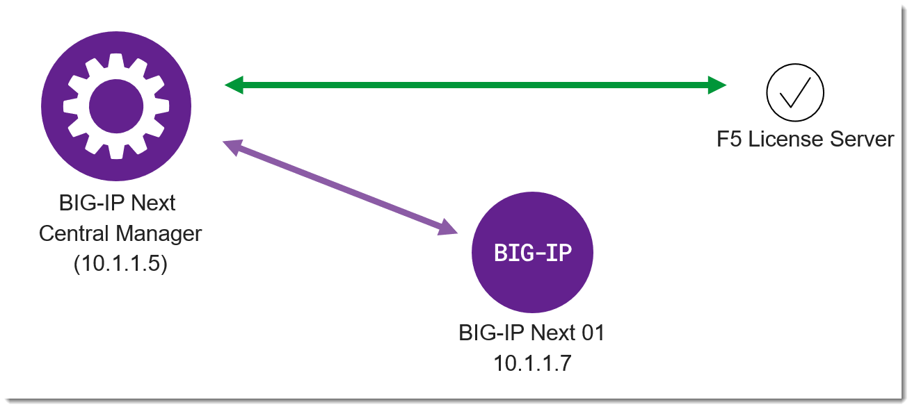

Lab 2.2 - License Standalone Instance
===============================================

After adding the BIG-IP Next instance to Central Manager in the previous lab you will need to activate the license on the device.

In this lab environment we have pre-loaded a 30-day evaluation license onto Central Manager.  Central Manager acts as a "License Manager" for devices that are connected.

Procedure
=========

#. Click the workspace switcher next to the F5 icon, and click **Infrastructure**.

    .. image:: ./lab2_img03_navigation_to_infrastructure2.png
		:scale: 25%

#. Click on the Name of the instance that you previously added "big-ip-next-01.f5demo.com"
    .. image:: ./click-on-big-ip-next-01.png
        :scale: 50%

#. Next click on the "Licensing" setting.  You should see that the status is "Inactive"
    .. image:: ./click-on-licensing-tab.png
        :scale: 50%
#. Click on "Activate License" and select an "Existing Token" and select the token named "test"
    .. image:: ./select-existing-token.png
        :scale: 50%
#. Click on "Activate".  The status should change to "Active"
    .. image:: ./central-manager-active-license.png
        :scale: 50%
