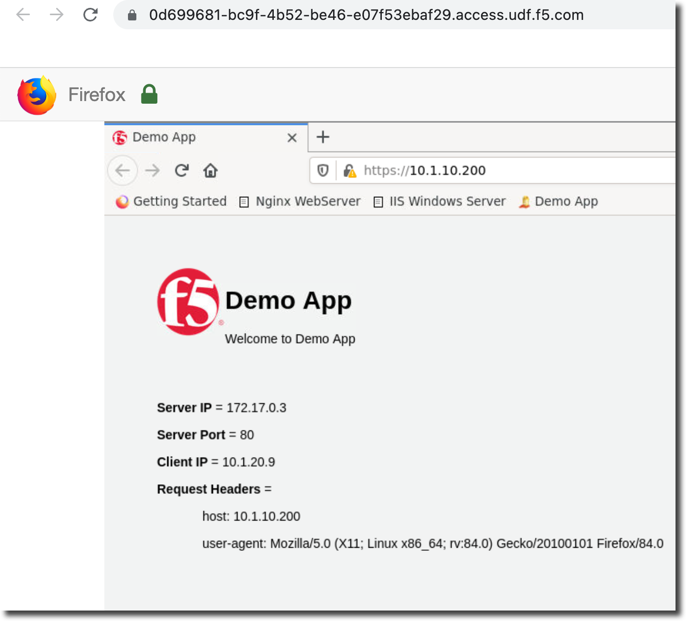

Lab 3.1 - Deploy and operate Applications
=========================================

This section of the lab will utilize the "Applications" section of Central Manager.

#. Navigate to Applications

    Navigate to Applications by clicking the workspace switcher next to the F5 icon

    .. image:: top-left.png
      :scale: 50%

    Then click on "Applications"

    .. image:: central-manager-menu.png
      :scale: 50%

#. Create Application
    
    From "My Apps" click on "+Add Application"

    .. image:: add-application.png
      :scale: 25%

    Click on "Create"

    .. image:: create-application.png
      :scale: 25%

#. Select "HTTPS-Load-Balancing-Service"

    .. image:: select-https-app.png
      :scale: 25%

#. Use the following inputs to create the app on the first screen.

    .. note:: If you were unable to add big-ip-next-01 in the previous lab you can use big-ip-next-03 instead

    =========================== ==========================
    Name                        Value
    --------------------------- --------------------------
    Location                    big-ip-next-01.f5demo.com
    --------------------------- --------------------------
    Application Name            https-app
    --------------------------- --------------------------
    Virtual Address             10.1.10.200
    --------------------------- --------------------------
    Virtual Port                443
    =========================== ==========================

    .. image:: create-application-tab1.png
      :scale: 25%

#. Click on "Next" to add endpoints (pool members) for the application.

#. Click on "Add Endpoints"

    .. image:: click-add-endpints.png
      :scale: 25%

#. Add the following endpoint address (optionally add a name)

    * Address: 10.1.20.100
    * Name: node1 (optional)

#. Click on "Save"

#. Change "Service Port" from 443 to 8080

#. Click on "Next"

#. For the Certificate select "self_demo.f5.com"

#. Click on "Next"

#. Click on "Validate"

#. Click on "View deployment validation results"

#. You will see a preview of the AS3 declaration that will be created by the template.

#. Click on "Exit" to leave the preview of the AS3 declaration

#. Click on "Deploy"

#. Open a new browser tab in the RDP client and go to https://10.1.10.200 (you will need to click past the cert errors)

#. You should now see the demo app

    
