=============================
Lab 4.1 - Import App from UCS
=============================

First, access the Windows Jump Host via RDP.

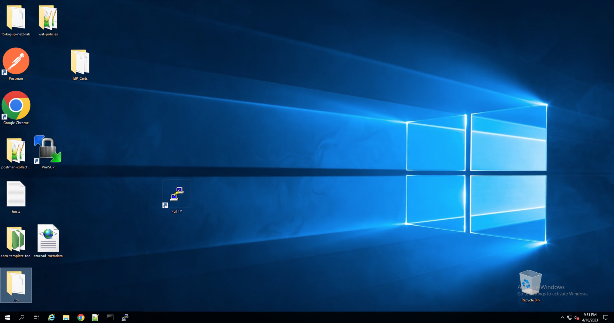

Launch Google Chrome to access BIG-IP Next CM 

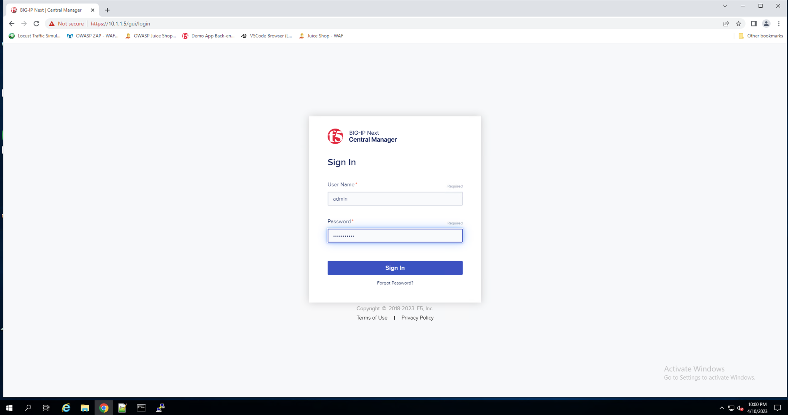

After logging into BIG-IP Next CM, click on  **"+Add Application"** on the upper right

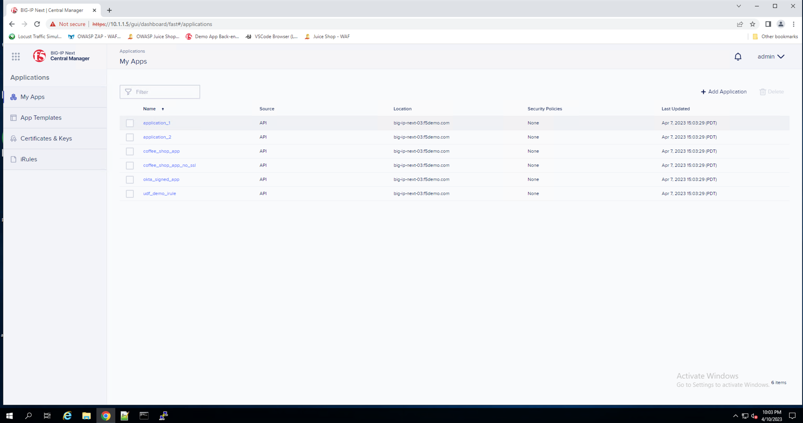

Select **"New Migration"** and enter the following information in General Propoerties:

* Session Name - **config-import**
* Description - **Agility2023 BIG-IP Next Lab**

Click **"Save & Continue"**

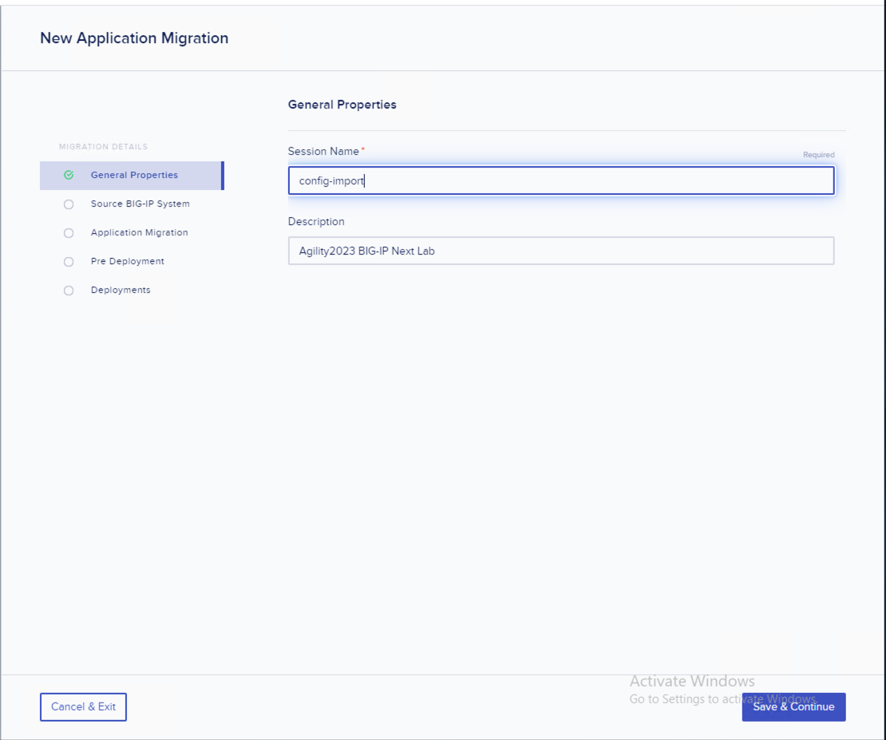

On the next step, you will select the the UCS file stored in the UCS folder on the Desktop as the Source

* Leave the **Master Key** and **Encrypted UCS Archives** options disabled.

Click **"Save & Continue"** 

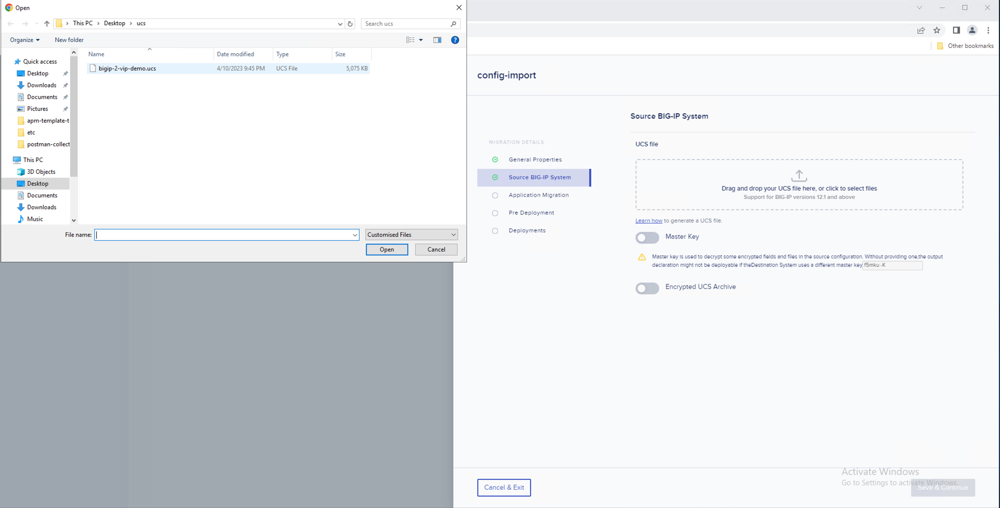

UCS file uploaded successful and click **"Save & Continue"**

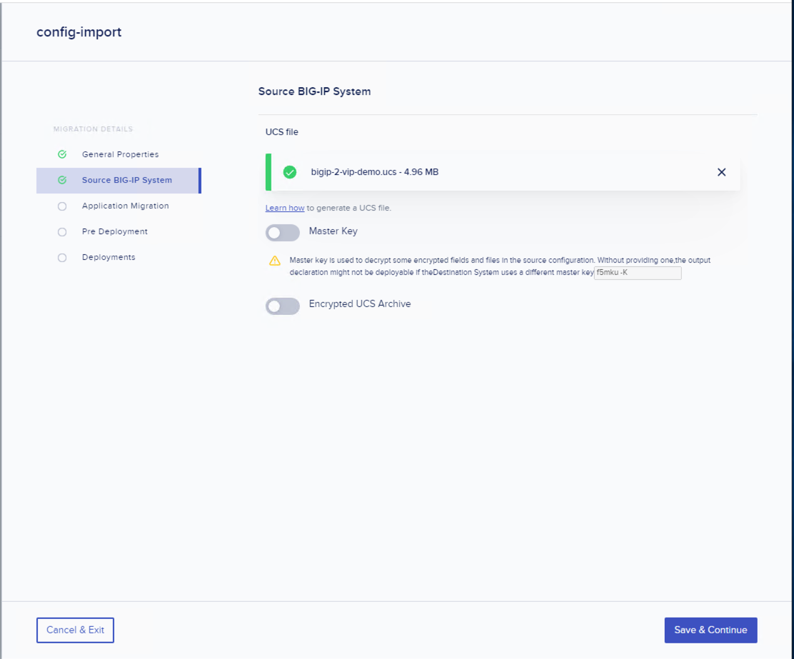

Select **"Add Application"** to import the applications from the UCS

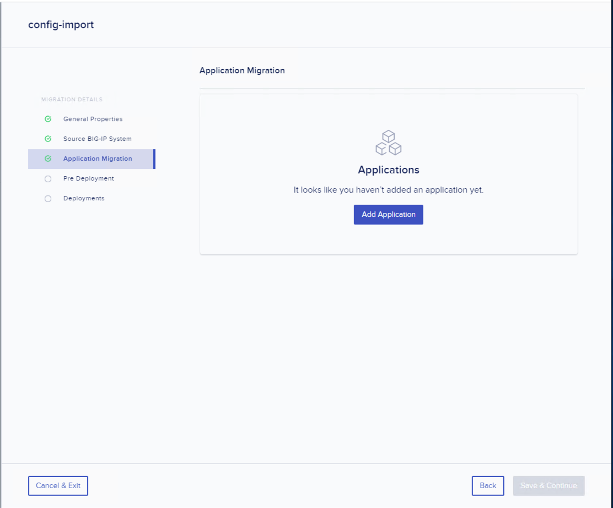

Select the 2 applications and click on **"Add"** 

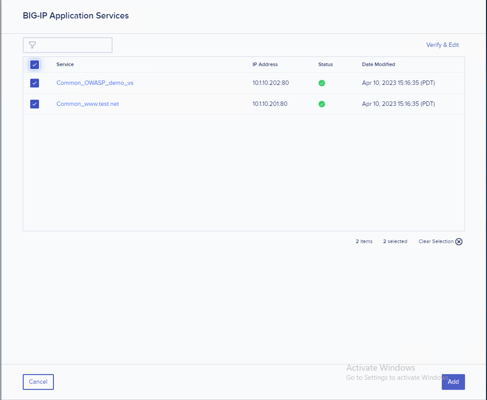

At the Application Migration menu, verify the 2 applications and click on **"Save & Continue"**

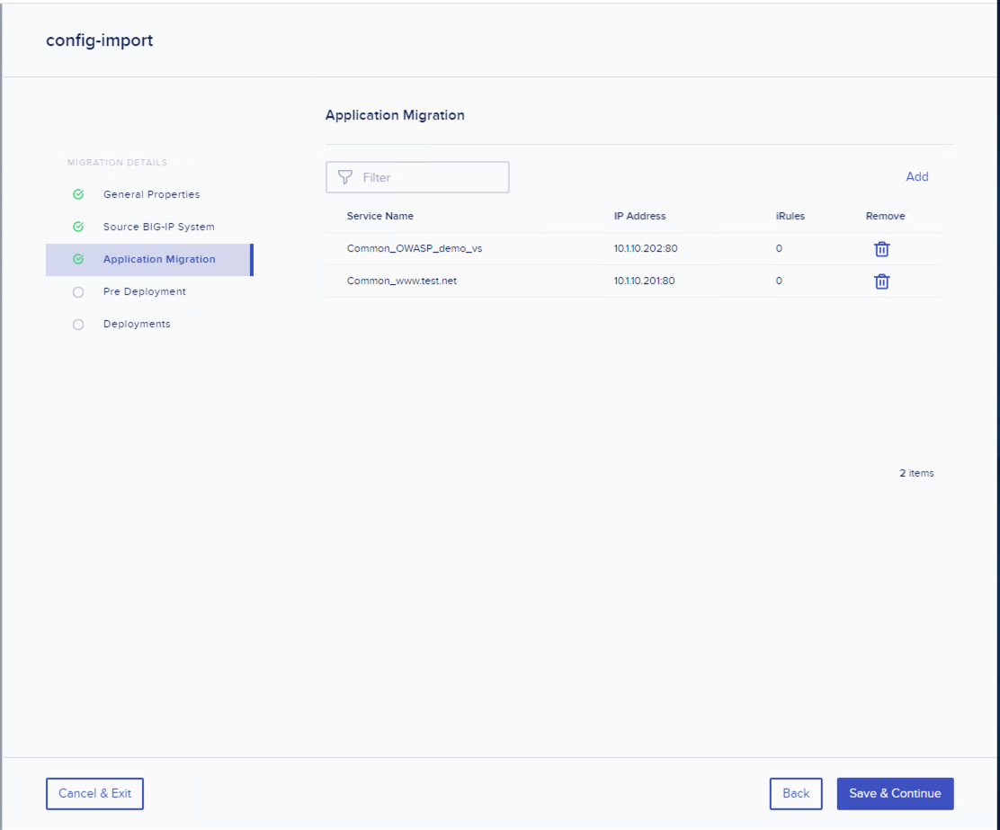

For Deployment Method, select the **API** option and for "Deploy Location" select **big-ip-next-03.f5demo.com (10.1.1.10)**

Then select **"Deploy"** and after about 30 seconds, both applications should showcase a green successful status icon.

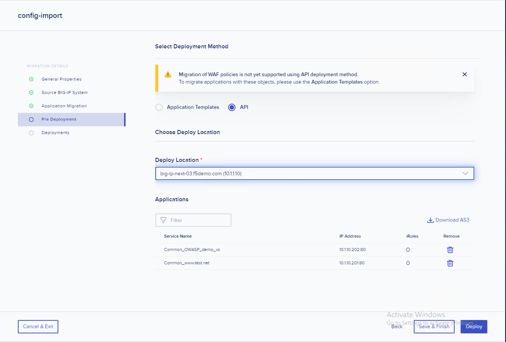

Click **Finish & Exit** and now at the My Apps screen you will be able to see the 2 new apps that you have imported.

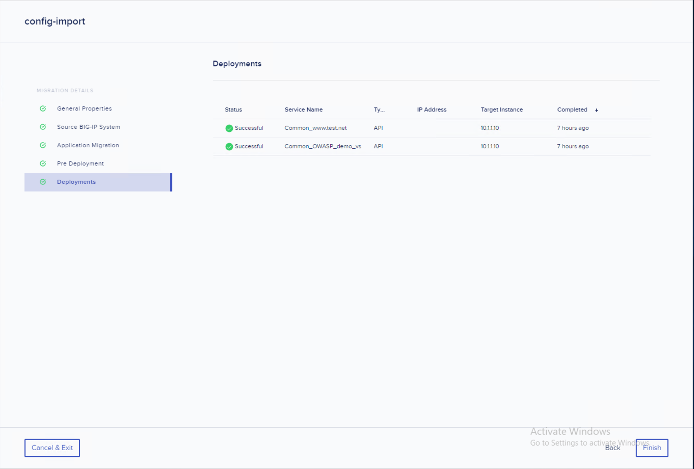
