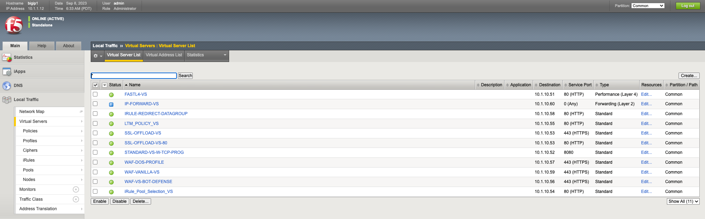
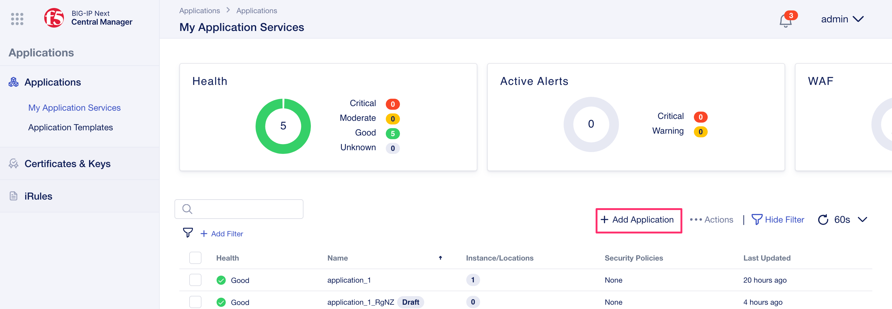
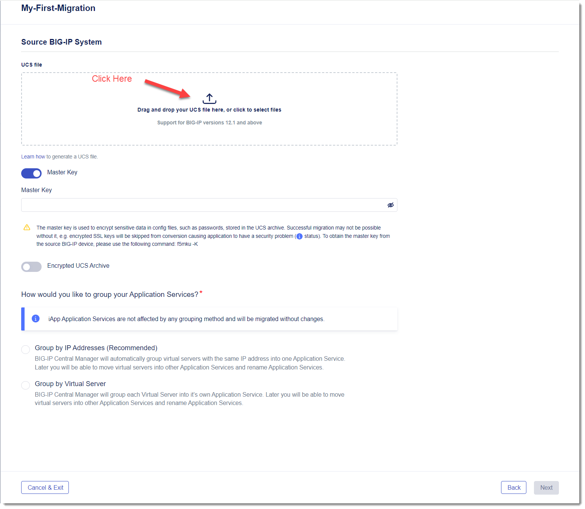
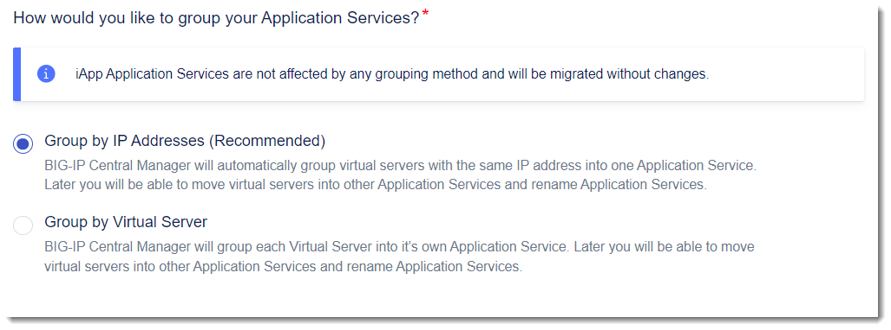
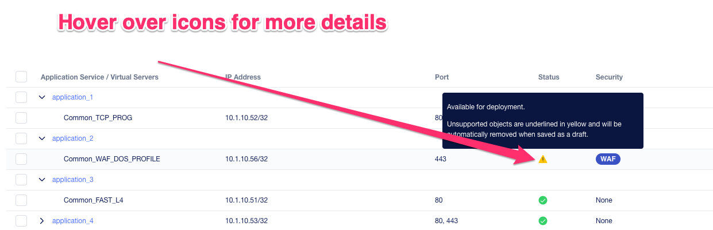
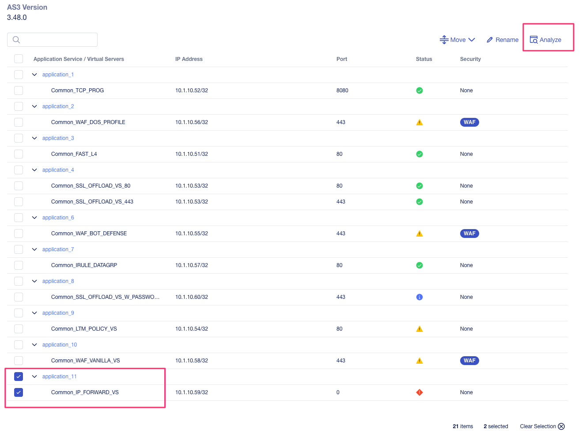
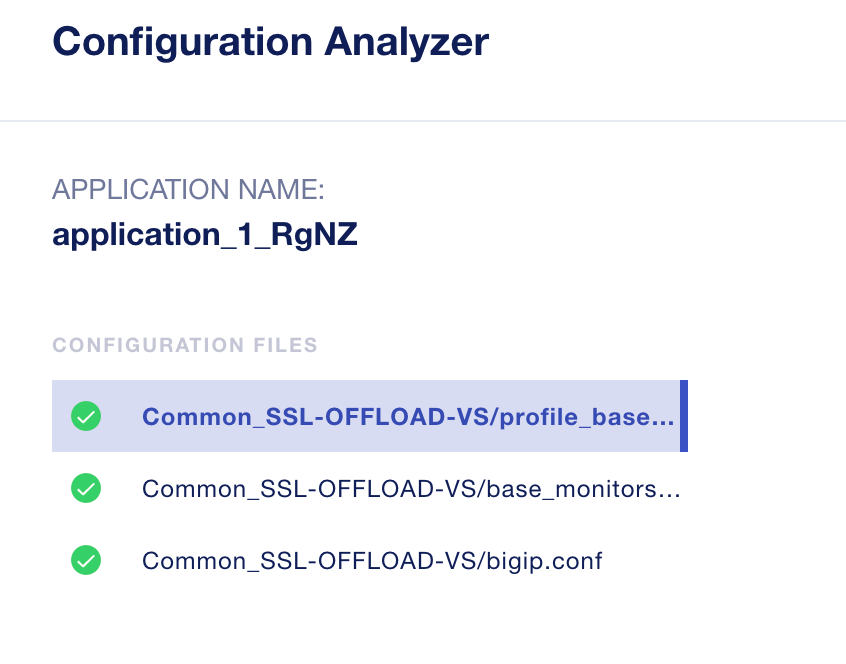

==============================================
Lab 4.2 - Migration from BIG-IP to BIG-IP Next
==============================================

In the UDF Blueprint there is a BIG-IP running version 15.1 that has a number of applications defined. Go to the UDF blueprint **Components** page and look for the item labeled **BIG-IP 15.1.x**  under the **F5 Products** column. Select the drop down menu next to **Access**, and then select **TMUI**. Log in with the credentials admin/admin.

.. image:: ./images/big-ip-udf.png
 :scale: 25%

 Review the current configuration of the BIG-IP, click on the **Local Traffic -> Virtual Servers** page an review the different types of virtual servers and their configuration. There is a mix of different virtual server types, and each is using different types of profiles, and some have iRules. Because of the limited resources within UDF these virtual servers will all use the same pool on the backend.

In order to migrate this BIG-IP configuration to BIG-IP Next, you'll need to create a UCS archive file on the BIG-IP and export it. Then you will import the UCS into Central Manager to view, analyze and migrate configurations. 

Since the archive file may have sensitive information such as certificates/keys it is recommended you use the Master Key functionality in BIG-IP to allow for a secure export of this type of information. In this lab, we will set the Master-Key password on the BIG-IP instance before creating an archive file. You'll then need to supply this information to Central Manager so that it can decrypt sensitive information and migrate it to a BIG-IP Next instance.

https://techdocs.f5.com/en-us/bigip-13-1-0/big-ip-secure-vault-administration/working-with-master-keys.html
https://my.f5.com/manage/s/article/K13132

To set a Master-Key on the BIG-IP system you can login to the console via the UDF interface. 

.. code-block:: bash

    root@(00deb7be-684a-4c52-856a-7335ef06a216)(cfg-sync Standalone)(Active)(/Common)(tmos)# show sys crypto 
    0 certificates found
    0 certificate revocation lists found
    0 CSRs found
    0 keys found
    FIPS 140 is not licensed.

    --------------------------------------
    Sys::Crypto Acceleration Distribution:
    --------------------------------------
    Primitive           Forced CPU  Total
    ECDH                         0      0
    ECDSA Sign                   0      0
    RSA encrypt/verify           0      0

    -------------------------------------------------------------------
    Sys::Encrypted Attributes
    Object Type                Object Name  Attribute  Valid Encryption
    -------------------------------------------------------------------
    profile_sctp               sctp         secret     1
    -----------------------------------------------------------------------------------------------------------
    Sys::Master-Key
    -----------------------------------------------------------------------------------------------------------
    master-key hash  <eT5Xc1cftojVy+TCU4qlazGE7jc5qgvwzD0gmACUD7d947X4Apq4o+us2cM4wju4K2b36Wv4VYOdDf5bvWOKmA==>
    previous hash    <eT5Xc1cftojVy+TCU4qlazGE7jc5qgvwzD0gmACUD7d947X4Apq4o+us2cM4wju4K2b36Wv4VYOdDf5bvWOKmA==>

    root@(00deb7be-684a-4c52-856a-7335ef06a216)(cfg-sync Standalone)(Active)(/Common)(tmos)# 

.. code-block:: bash

    root@(00deb7be-684a-4c52-856a-7335ef06a216)(cfg-sync Standalone)(Active)(/Common)(tmos)#  modify sys crypto master-key prompt-for-password
    enter password: 
    password again: 
    root@(00deb7be-684a-4c52-856a-7335ef06a216)(cfg-sync Standalone)(Active)(/Common)(tmos)# 

.. code-block:: bash

    root@(00deb7be-684a-4c52-856a-7335ef06a216)(cfg-sync Standalone)(Active)(/Common)(tmos)# save sys config
    Saving running configuration...
    /config/bigip.conf
    /config/bigip_base.conf
    /config/bigip_script.conf
    /config/bigip_user.conf
    Saving Ethernet map ...done
    Saving PCI map ...
    - verifying checksum .../var/run/f5pcimap: OK
    done
    - saving ...done
    root@(00deb7be-684a-4c52-856a-7335ef06a216)(cfg-sync Standalone)(Active)(/Common)(tmos)# 

Go to the **Systems -> Archive** page in the BIG-IP GUI and click the **Create** button to create a new UCS archive file. When creating the UCS archive

Import UCS into Central Manager
===============================

Log into Central Manager and click on the **Go to Applications Workspace** button. You will be taken to the Applications main page, where you can then click the **Add Application** button.

Here you can either create a brand new application, create a new migration, or resume an existing migration that you have started previously. Under the **Migrate Application(s)** section select **New Migration**.

.. image:: ./images/new-migration.png
 :scale: 25%

Give the migration a Name and Description as seen below:

.. image:: ./images/first-migration.png
 :scale: 25%

Here you'll need to upload the UCS archive file you exported from your BIG-IP system. Click on the area noted below, and a screen will pop up allowing you to select the UCS file from your local computer.

Master Key and Passphrase
=========================

.. image:: ./images/ucs-master-key.png
 :scale: 25%

Grouping of Application Services
================================

Central Manager provides two options for grouping application services. You may group them by **IP Addresses (Recommended)** or by **Virtual Server**.
Grouping by IP addresses is recommended because it will group and migrate all services that use the same virtual IP address together. It would be very difficult to migrate services that use the same IP address but separate ports at different times, because typically the IP address will move from the source device to the target device during the migration. 

Analyze Configuration
=====================

After filling in the source BIG-IP information and loading the UCS file, a list of **Applications** will be displayed. Depending on the type of grouping selected, and how the applications are configured, you may see a single service per application, or you may see multiple services if grouping by IP Addresses was selected. Each application service will display the virtual server address, port, a color coded status indicating its eligibility for migration, and a security status column. You can hover over the Status icon for each application to get more detail on its migration eligibility.

Here you can select individual applications to analyze them to see if they are eligible to be migrated to BIG-IP Next. Not all BIG-IP features are supported, and there will be a phasing of some configuration objects. 

To see if an application is eligible for migration, click the application name as well as the virtual service underneath it and then click the **Analyze** button in the top right-hand corner off the screen.

 This will open the **Configuration Analyzer** page and you will see the BIG-IP configuration display from different files such as bigip.conf, or some of the default profile and monitor files. Each file will have a status associated with it indicating if there is a migration issue or not.

 
 You can browse the configuration of each file for and any unsupported items, or items that may need adjusting, they will be highlighted with a red line. You can also see this on the summary preview on the left hand side of the display to zoom in on where in the file the problem may be.

Migrate Applications to BIG-IP Next
===================================

test