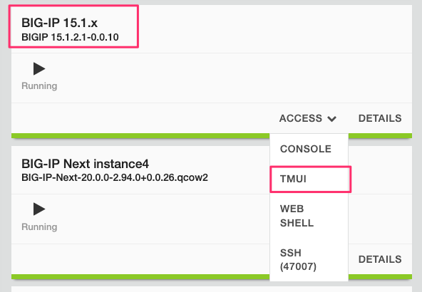

==============================================
Lab 4.2 - Migration from BIG-IP to BIG-IP Next
==============================================

In the UDF Blueprint there is a BIG-IP running version 15.1 that has a number of applications defined. Go to the UDF blueprint **Components** page and look for the item labeled **BIG-IP 15.1.x**  under the **F5 Products** column. Select the drop down menu next to **Access**, and then select **TMUI**. Log in with the credentials admin/admin.

 Review the current configuration of the BIG-IP, click on the **Local Traffic -> Virtual Servers** page an review the different types of virtual servers and their configuration. There is a mix of different virtual server types, and each is using different types of profiles, and some have iRules. Because of the limited resources within UDF these virtual servers will all use the same pool on the backend.

.. image:: ./images/big-ip-udf-virtual-servers.png
 :scale: 25%

In order to migrate this BIG-IP configuration to BIG-IP Next, you'll need to create a UCS archive file on the BIG-IP and export it. Then you will import the UCS into Central Manager to view, analyze and migrate configurations. 

Since the archive file may have sensitive information such as certificates/keys it is recommended you use the Master Key functionality in BIG-IP to allow for a secure export of this type of information. In this lab, we will set the Master-Key password on the BIG-IP instance before creating an archive file. You'll then need to supply this information to Central Manager so that it can decrypt sensitive information and migrate it to a BIG-IP Next instance.

https://techdocs.f5.com/en-us/bigip-13-1-0/big-ip-secure-vault-administration/working-with-master-keys.html
https://my.f5.com/manage/s/article/K13132

To set a Master-Key on the BIG-IP system you can login to the console via the UDF interface. 

.. code-block:: bash

    root@(00deb7be-684a-4c52-856a-7335ef06a216)(cfg-sync Standalone)(Active)(/Common)(tmos)# show sys crypto 
    0 certificates found
    0 certificate revocation lists found
    0 CSRs found
    0 keys found
    FIPS 140 is not licensed.

    --------------------------------------
    Sys::Crypto Acceleration Distribution:
    --------------------------------------
    Primitive           Forced CPU  Total
    ECDH                         0      0
    ECDSA Sign                   0      0
    RSA encrypt/verify           0      0

    -------------------------------------------------------------------
    Sys::Encrypted Attributes
    Object Type                Object Name  Attribute  Valid Encryption
    -------------------------------------------------------------------
    profile_sctp               sctp         secret     1
    -----------------------------------------------------------------------------------------------------------
    Sys::Master-Key
    -----------------------------------------------------------------------------------------------------------
    master-key hash  <eT5Xc1cftojVy+TCU4qlazGE7jc5qgvwzD0gmACUD7d947X4Apq4o+us2cM4wju4K2b36Wv4VYOdDf5bvWOKmA==>
    previous hash    <eT5Xc1cftojVy+TCU4qlazGE7jc5qgvwzD0gmACUD7d947X4Apq4o+us2cM4wju4K2b36Wv4VYOdDf5bvWOKmA==>

    root@(00deb7be-684a-4c52-856a-7335ef06a216)(cfg-sync Standalone)(Active)(/Common)(tmos)# 

.. code-block:: bash

    root@(00deb7be-684a-4c52-856a-7335ef06a216)(cfg-sync Standalone)(Active)(/Common)(tmos)#  modify sys crypto master-key prompt-for-password
    enter password: 
    password again: 
    root@(00deb7be-684a-4c52-856a-7335ef06a216)(cfg-sync Standalone)(Active)(/Common)(tmos)# 

.. code-block:: bash

    root@(00deb7be-684a-4c52-856a-7335ef06a216)(cfg-sync Standalone)(Active)(/Common)(tmos)# save sys config
    Saving running configuration...
    /config/bigip.conf
    /config/bigip_base.conf
    /config/bigip_script.conf
    /config/bigip_user.conf
    Saving Ethernet map ...done
    Saving PCI map ...
    - verifying checksum .../var/run/f5pcimap: OK
    done
    - saving ...done
    root@(00deb7be-684a-4c52-856a-7335ef06a216)(cfg-sync Standalone)(Active)(/Common)(tmos)# 

Go to the **Systems -> Archive** page in the BIG-IP GUI and click the **Create** button to cretae a new UCS archive file. When creating the UCS archive 