==============================================
Lab 4.2 - Migration from BIG-IP to BIG-IP Next
==============================================

In this lab you will create a UCS archive from a BIG-IP instance and then import it into Central Manager. Then you will ananlyze applications to determine their eligibility to migrate to BIG-IP Next. Next, you will import shared objects, and select individual applications to migrate, save them as a draft migration, and then migrate them to a BIG-IP Next instance. 

In the UDF Blueprint there is a BIG-IP running version 15.1 that has a number of applications defined. Go to the UDF blueprint **Components** page and look for the item labeled **BIG-IP 15.1.x**  under the **F5 Products** column. Select the drop down menu next to **Access**, and then select **TMUI**. Log in with the credentials admin/admin.

.. image:: ./images/big-ip-udf.png
  :align: center
  :scale: 75%

Create BIG-IP UCS File 
======================

In order to migrate this BIG-IP configuration to BIG-IP Next, you'll need to create a UCS archive file on the BIG-IP and export it. Then you will import the UCS into Central Manager to view, analyze and migrate applications. Central Manager performs migrations at the application-level which allows customers to gradually migrate to BIG-IP Next. This is different than the traditional UCS based migration where an entire BIG-IP device, vCMP guest or Virtual Edition are migrated all at once. Since features are being phased into BIG-IP Next, it may not be possible to move all applications to BIG-IP Next initially. The per-app migration capability allows customers to identify which applications are ready to migrate to Next, and provides workflows to move individual applications. If all applications are eligble for migration, then they can all be migrated at one time. In many customers, it is expected that the migration to BIG-IP Next will be gradual, and BIG-IP and BIG-IP Next will co-exist for some time during the migration process.

Review the current configuration of the BIG-IP, click on the **Local Traffic -> Virtual Servers** page an review the different types of virtual servers and their configuration. There is a mix of virtual server types, and each is using different types of profiles, some have iRules, some have certificates, and others have WAF policies. Because of the limited resources within UDF these virtual servers will all use the same pool on the backend.

.. image:: ./images/big-ip-udf-virtual-servers.png
  :align: center
  :scale: 75%

Since the archive file may have sensitive information such as certificates/keys it is recommended that you use the Master Key functionality in BIG-IP to allow for a secure export of this type of information. In this lab, we will retrieve the Master-Key on the BIG-IP instance before creating an archive file. You'll then need to supply this information to Central Manager so that it can decrypt sensitive information and migrate it to a BIG-IP Next instance. Some background information on Master-Keys on the BIG-IP is provided below.

`Working with Master Keys <https://techdocs.f5.com/en-us/bigip-13-1-0/big-ip-secure-vault-administration/working-with-master-keys.html>`_

`K13132: Backing up and restoring BIG-IP configuration files with a UCS archive <https://my.f5.com/manage/s/article/K13132>`_

To obtain the master-key from the source BIG-IP system, go to the main UDF screen and go to the **F5 Products** column and select the drop down menu for **Access** under the **BIG-IP 15.1.x** item. Select **Console** to attach the the BIG-IP console. Alternatively, if you have loaded your ssh keys into UDF, you can attach via SSH so its easier to copy the master key. When using the embedded console in UDF, there is no copy capability so you will have to write down the master-key and enter it manaully when importing the UCS into Central Manager. 

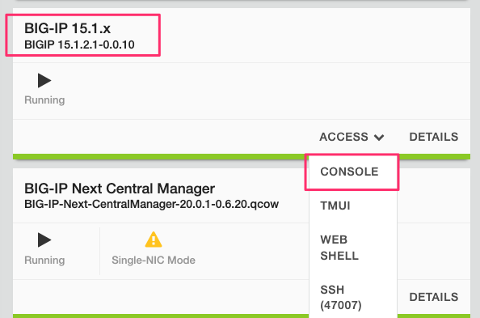

Login with the credentials root/default, and then enter the command **f5mku -K** to get the BIG-IP's master-key. Now, copy or write down the master-key as you will need this when importing the UCS into Central Manager.

.. code-block:: bash

    [root@ce6e127b-032e-496c-afb5-b303545907ef:Active:Standalone] config # f5mku -K
    cgGaYTNid4Gvqdelf/85cw==
    [root@ce6e127b-032e-496c-afb5-b303545907ef:Active:Standalone] config #

In the BIG-IP webUI, go to the **Systems -> Archive** page and click the **Create** button to create a new UCS archive file. 

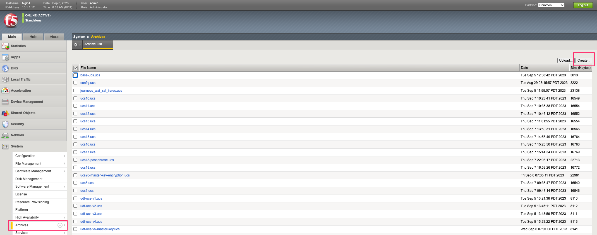

When creating the UCS archive supply a Name, enable Ecryption, then supply a passphrase (that you will remmeber), and confirm the passphrase. Then click **Finished**. Click **OK** after the archive has completed. 

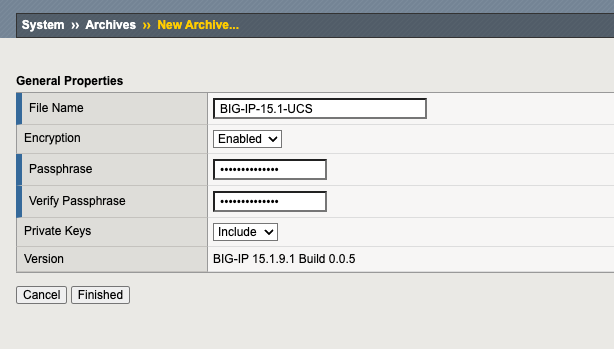

Your achive file should be displayed in the summary, click on it.

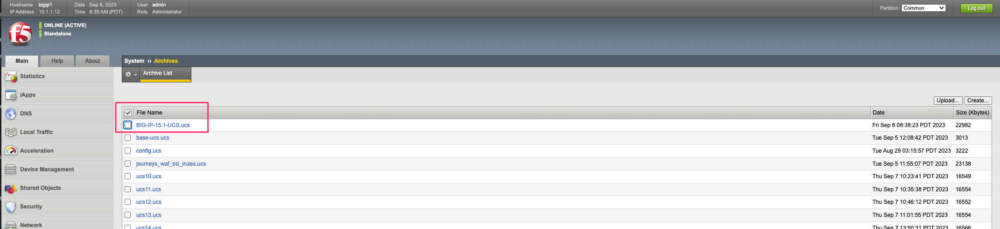

You should see something similar to the output below. Click the Download option to download the UCS file to your local machine. 

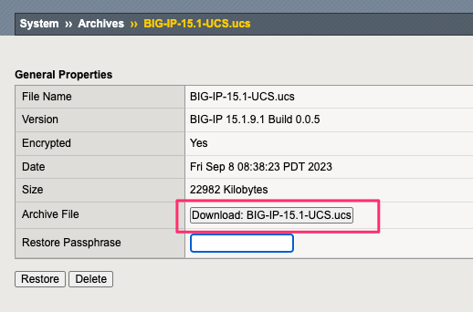

Import UCS into Central Manager
===============================

Log into Central Manager and click on the **Go to Applications Workspace** button. You will be taken to the Applications main page, where you can then click the **Add Application** button.

.. image:: ./images/central-manager-add-apps.png
  :align: center
  :scale: 50%

Here you can either create a brand new application, create a new migration, or resume an existing migration that you have started previously. Under the **Migrate Application(s)** section select **New Migration**.

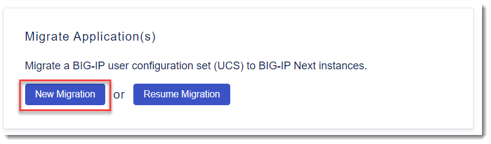

Give the migration a **Session Name** and **Description** as seen below, then click **Next**.

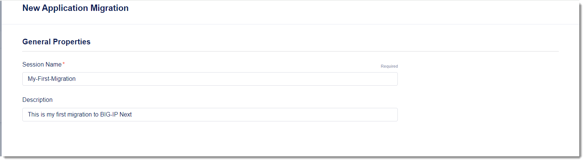

Here you'll need to upload the UCS archive file you exported from your BIG-IP system. Click on the area noted below, and a screen will pop up allowing you to select the UCS file from your local computer.

.. image:: ./images/ucs-file.png
  :align: center
  :scale: 50%

Master Key and Passphrase
=========================

Since the archive file may have sensitive information such as certificates/keys it is recommended you use the Master Key functionality in BIG-IP to allow for a secure export of this type of information. In this lab, we will use the Master-Key from the BIG-IP instance that you viewed before creating an archive file. You'll then need to supply this information to Central Manager so that it can decrypt sensitive information and migrate it to a BIG-IP Next instance.

Enter the **Master-Key** that you obtained from your BIG-IP, and then enable **Encrypted UCS Archive** enter the **Passphrase** you entered when creating the UCS archive in the **Password** field. 

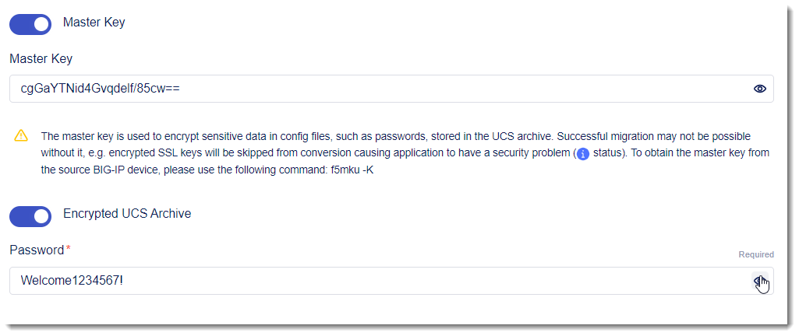

Grouping of Application Services
================================

Central Manager provides two options for grouping application services. You may group them by **IP Addresses (Recommended)** or by **Virtual Server**. Grouping by IP addresses is recommended because it will group and migrate all services that use the same virtual IP address together. It would be very difficult to migrate services that use the same IP address but separate ports at different times, because typically the IP address will move from the source device to the target device during the migration. Choose **Group by Addresses (Recommended)**.

.. image:: ./images/ucs-grouping.png
  :align: center
  :scale: 50%

Click **Next** and the UCS file will be uploaded and analyzed.

Analyze Configuration
=====================

After filling in the source BIG-IP information and loading the UCS file, an **Application Migration** page will be displayed. Click **Add Application**.

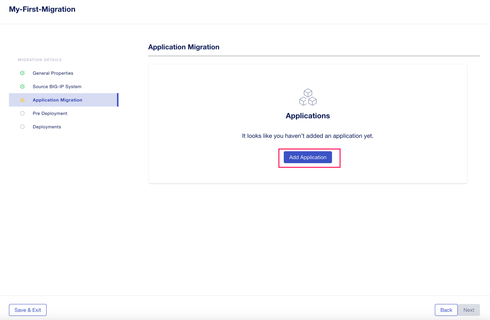

The applications from your BIG-IP will now be displayed as Application Services.

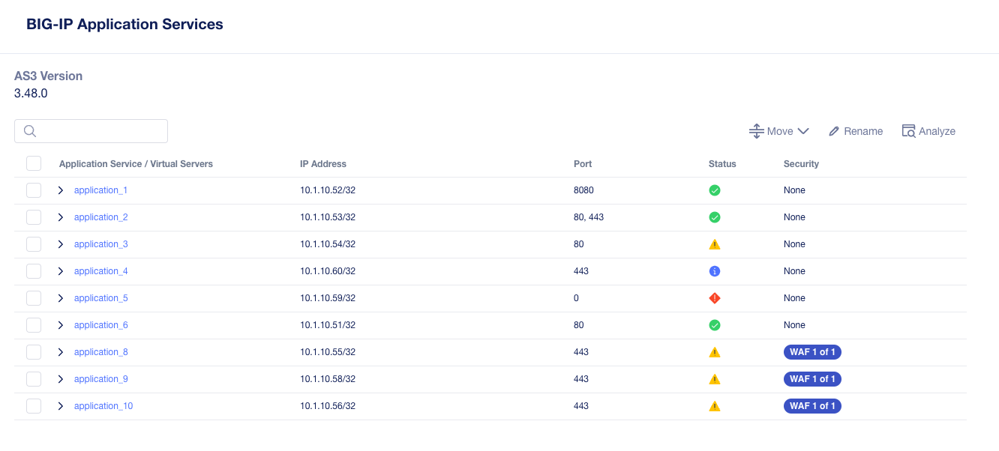

Depending on the type of grouping selected, and how the applications are configured, you may see a single virtual service per application, or you may see multiple virtual services if grouping by IP Addresses was selected and an application has more than one port. Each application service will display the virtual server address, port, a color coded status indicating its eligibility for migration, and a security status column. You can hover over the Status icon for each application to get more detail on its migration eligibility.

.. image:: ./images/icon-hover.png
  :align: center
  :scale: 75%

Here you can select individual applications to analyze them to see if they are eligible to be migrated to BIG-IP Next. Not all BIG-IP features are currenlty supported on Next. There will be a phasing of support for some configuration objects so it is expected that some applications cannot migrate at the current time. 

To see if an application is eligible for migration, click the application name as well as the virtual service underneath it and then click the **Analyze** button in the top right-hand corner off the screen. Note: You can only analyze one application service at a time. 

.. image:: ./images/analyze.png
  :align: center
  :scale: 50%

This will open the **Configuration Analyzer** page and you will see the BIG-IP configuration display from different files such as bigip.conf, or some of the default profile and monitor files. Each file will have a status associated with it indicating if there is a migration issue or not. Note: There is an enhancement logged to update the status icons of each file individually, right now some files are being grouped together, when there is not an issue in that particular file. 

.. image:: ./images/analyzer-green-files.png
  :align: center
  :scale: 75%
 
You can browse the configuration of each file for and any unsupported items, or items that may need adjusting, they will be highlighted with a squiggly yellow, red, or blue line. You can also see this on the summary preview on the left hand side of the display, it will allow you to quickly zoom in to where the problem may be in the file. Below is an example of a file with a migration issue and the squiggly yellow line notes where the issue is in both the summary and in the scroll bar.

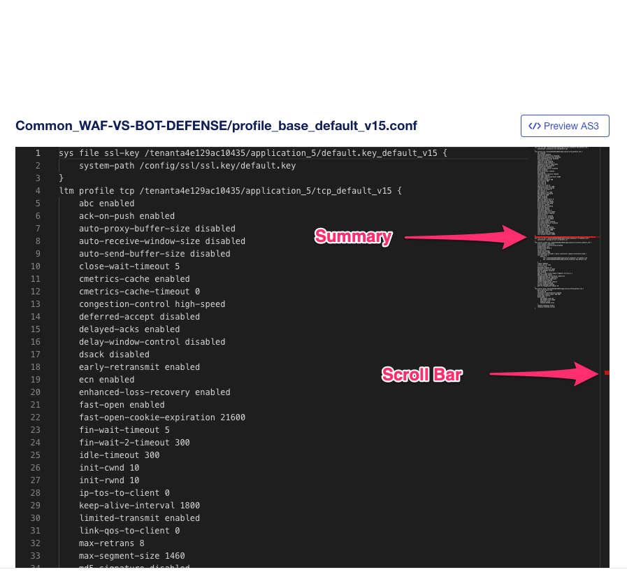

You can click on the yellow line in the scroll bar and it will take you to the part of the file that has the migration issue. The squiggly yellow line will note the configuration object that is not supported. 

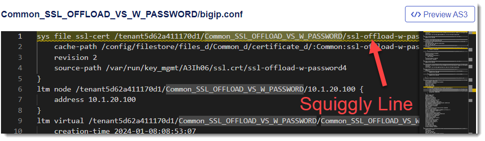

You can hover over the squiggly line to get more details about the unsupported object. You can also click the **View Problem** message for addtional details.

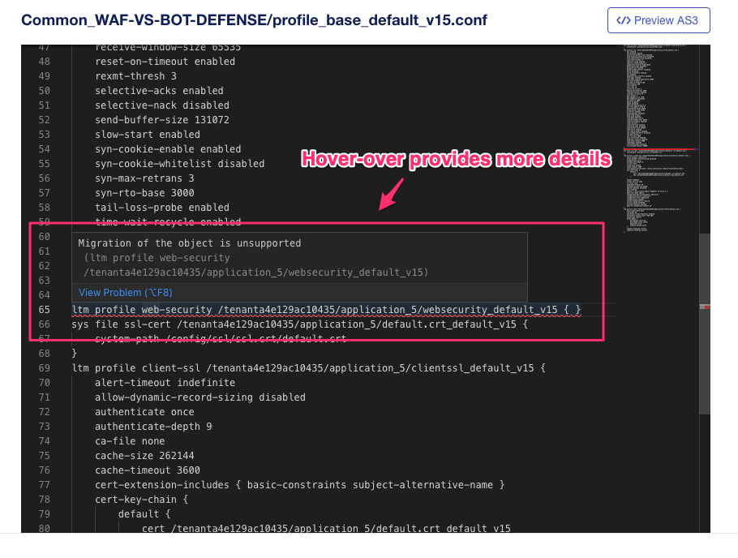

Using the Configuration Analyzer you can make a determination if an application service is ready for migration, or if you may have to wait until additional functionality is integrated into BIG-IP Next. BIG-IP Next is on a much more rapid release schedule than TMOS, so new features are being integrated on regular invtervals.

Migrate Applications to BIG-IP Next
===================================

Applications with status indicating a yellow triangle or blue information icon may not be ready for migration, or may need some changes to fully migrate to BIG-IP Next. A red icon is an unsupported object and cannot be migrated to BIG-IP Next. For this lab, we will first attempt to migrate all the green application services to BIG-IP Next. Before migrating the applications, it is a good idea to rename each application service to use a name that better represents the application instead of the genneric style names (application_1, application_2 etc...). Go ahead and rename each application, try and use the name nested underneath the application service name, so its clear what the applications are configured for, as the names are descriptive of the use case.

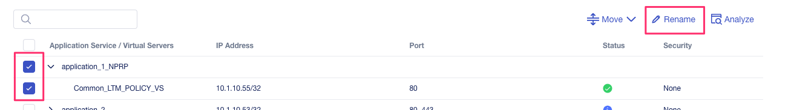

Below is an exmaple of the pop-up that will appear when you try and rename an application service.

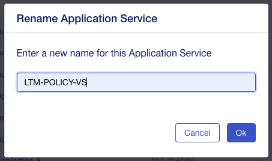

After renaming the application services, the new names should be reflected in the output as seen below. Do this for every application.

.. image:: ./images/rename-applications-3.png
  :align: center
  :scale: 75%

After all the application services have been renamed, select all the green status services and then select the **Add** button. This will indicate that you are either ready to migrate these services, or that you are going to save them as a draft application service. After adding these applications you'll have more options on the next screen before making a decision.

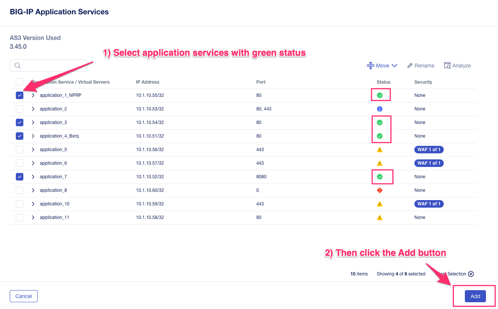

The next screen will present an Application Migration summary. Here, you can review the applications that you wish to move forward with, or you can remove an application from the migration. This doesn't delete the application, it is still in the UCS and you can go back later and add it again. If you forgot an application, you can click the **Add** button to go back to the remaining applications and add other apps if you wish. Once you are satisfied with the summary of applications, click **Next**.

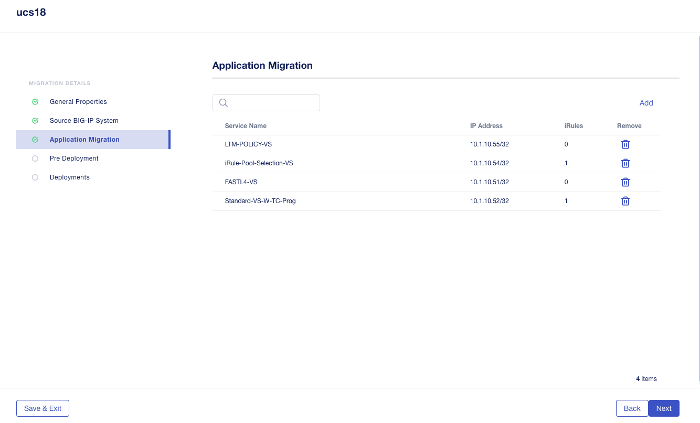

The next phase is the **Pre Deployment**, here you can **Import** shared configration objects associated with the application into Central Manager. Examples of shared objects would be iRules, WAF policies, Certificates etc... These objects are treated differently than the rest of the configuration because they are managed centrally and not specific to any one device, or in the case of certificates Central Manager is managing those centrally. As an example, in traditional BIG-IP management, iRules are managed on a device-by-device basis, there is no central iRule management. Central Manager addresses this issue and allows iRules to be imported and treated as shared objects, meaning they can be shared and deployed to more than one device. Central Manager manages the entire iRule lifecycle including deployment and versioning. This is huge improvement over traditional BIG-IP iRule management. Other shared objects such as WAF policies enjoy similar benefits of centralized mangement, versioning, and full lifecycle management. 

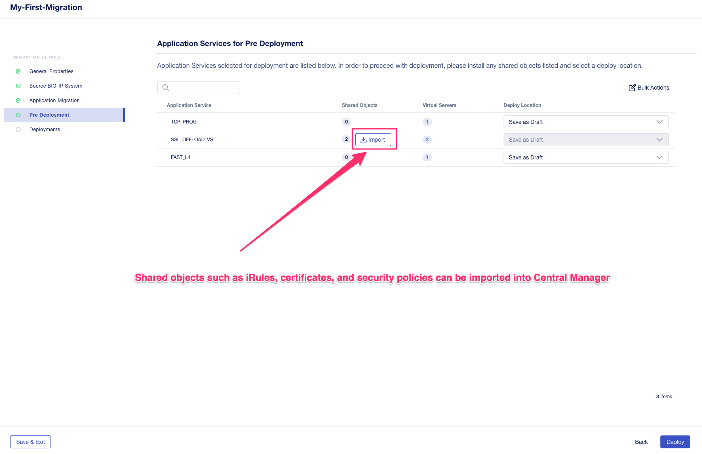

To understand what the shared object is, click on the number under the **Shared Objects** column. A flyout window will appear with more information about that shared object.

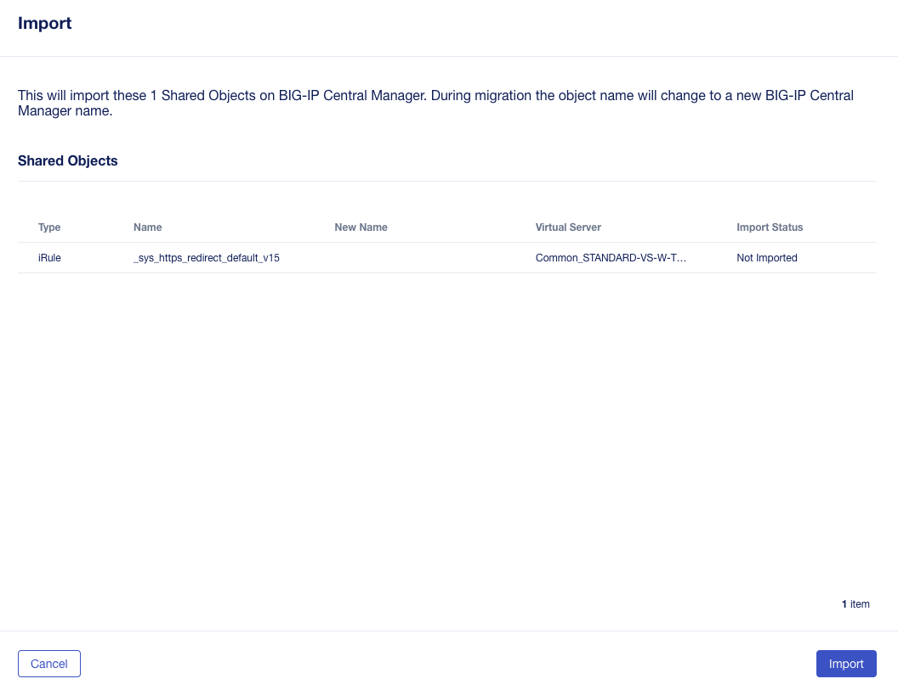

Click the **Import** buttons for the applications that have shared objects. You'll also have the ability to select on a per-application basis whether the migration is saved as a **Draft** application (so you can save for later) or whether it is deployed to a specific BIG-IP Next instance. You will come back to this page momentarily.

Before migrating the applications to BIG-IP Next, lets ensure that each application is working on BIG-IP from the Windows client. Log into the Windows Jumphost using the **RDP** option in the main UDF screen. This will download an RDP shortcut to your machine. 

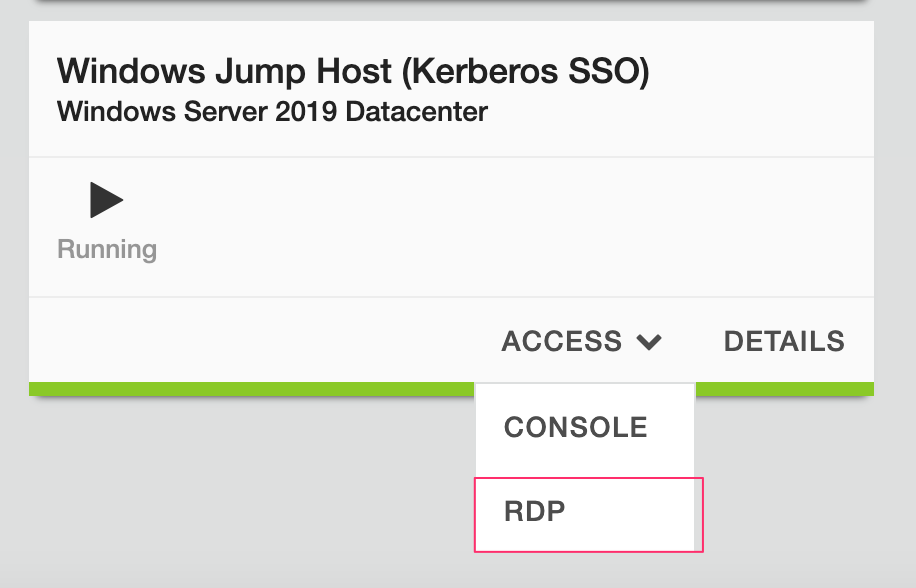

Open up the RDP shortcut to connect to the Windows Jumphost. change the username to **f5access\user** and the password to **user** and log in.

.. image:: ./images/f5access-user.png
  :align: center
  :scale: 75%

On the Windows jumphost open a **cmd** window. You will now test to ensure the source BIG-IP virtual servers are responding.

- FASTL4-VS - curl 10.1.10.51 -I
- STANDARD-VS-W-TCP-PROG-VS - curl 10.1.10.52:8080 -I
- SSL-OFFLOAD-VS - curl 10.1.10.53 -I
- LTM-POLCY-VS - curl 10.1.10.55 -I

They should all respond with a **200 OK** message as seen below.

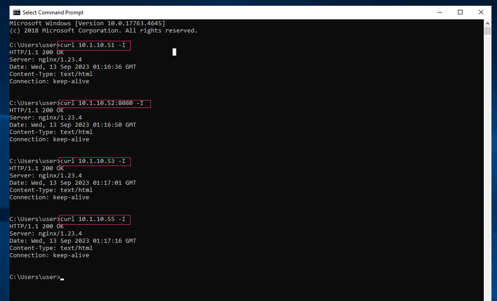

Because you will preserve the BIG-IP virtual server address as part of the migration, you will need to disable all the source BIG-IP virtual servers to prevent duplicate IP address conflicts.

Login into the BIG-IP webUI from the UDF interface. Login using the credentials **admin/admin**. Got to the **Local Traffic -> Virtual Servers -> Virtual Addresses** page. 

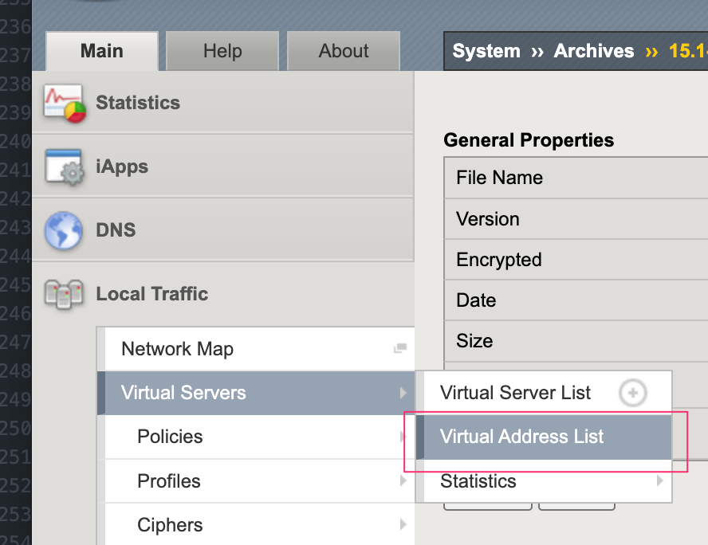

Select all Virtual Addresses, and then select **Disable**.

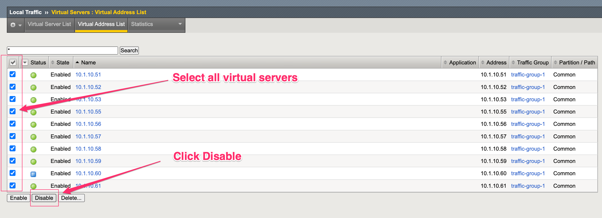

All Virtual Addresses should now show in the **Disabled** state.

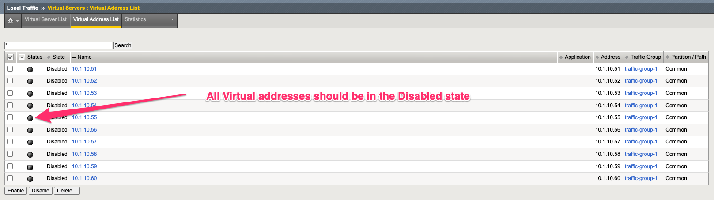

You can re-run the curl commands on the Windows jump host to ensure the virtual addresses are unrepsonsive. Now go back to the Central Manager pre-migration screen. For now, we will set all Locations for the green applications to **big-ip-next-03-f5demo.com**. Then click **Deploy**.

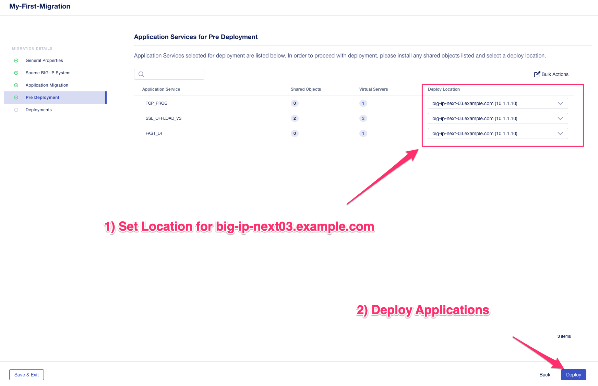

You may see a temporary **Bad Gateway** message, this is a known issue. After a bit of time the migration of the applications to BIG-IP Next should complete. You have now migrated your green applications to BIG-IP Next! Click the **Finish** button.

.. image:: ./images/successful-migration.png
  :align: center
  :scale: 75%

To verify the applications migrated successfully, go back to the Windows jumphost an re-run the curl commands to make sure the applications are live again.

Next, you'll go back to the saved migration and move some additional applications. Click the **Add Applications** button on the Applications Summary screen.

.. image:: ./images/add-apps2.png
  :align: center
  :scale: 75%

Then, select the **Resume Migration** option to go back into the migration you saved previously.

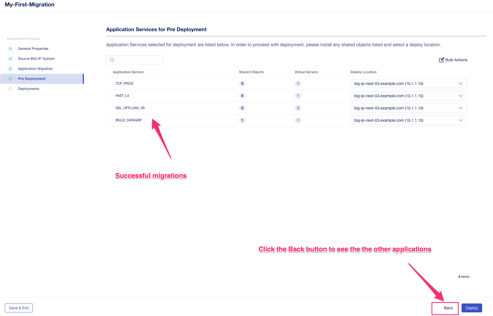

Then click on the UCS Name hyperlink to open the migration back up. Here, you will see the list of applications that have already migrated from this saved session. Click the **Back** button to see the remaining applications.

.. image:: ./images/resume-migration-back.png
  :align: center
  :scale: 75%

Click the **Back button once more.

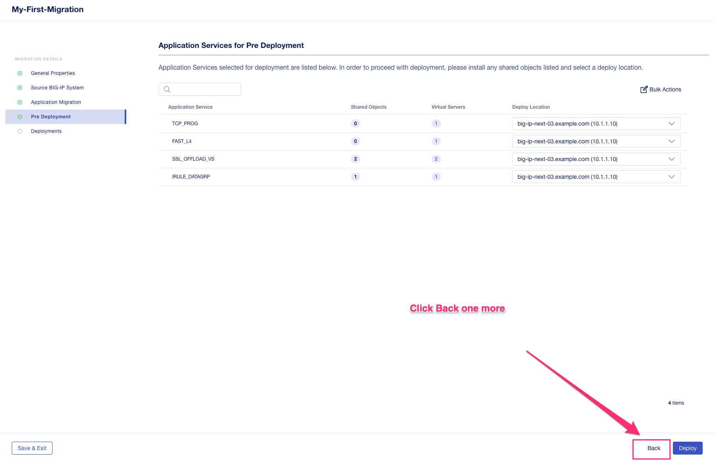

Then click the **Add** button to see all the apps.

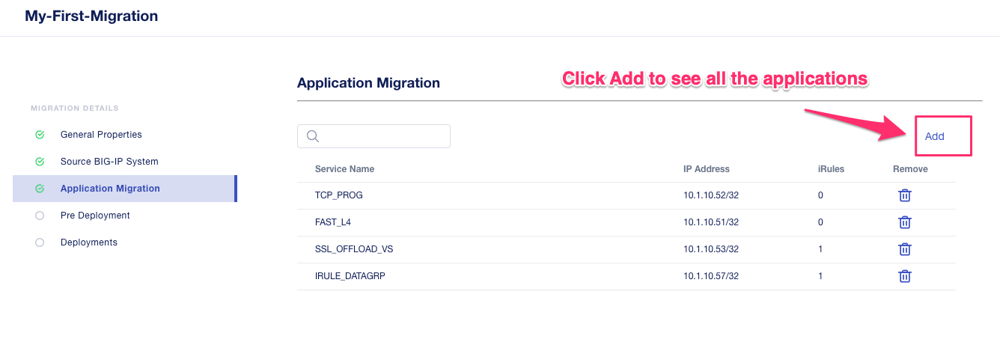

Next we will stage a draft migration, and demonstrate the capability of editing the configuration before migrating. Unselect all the green apps that have migrated to BIG-IP Next already, then sleect all 3 WAF applications, and the SSL-OFFLOAD-W-PASSWORD application. Then click **Add*. 

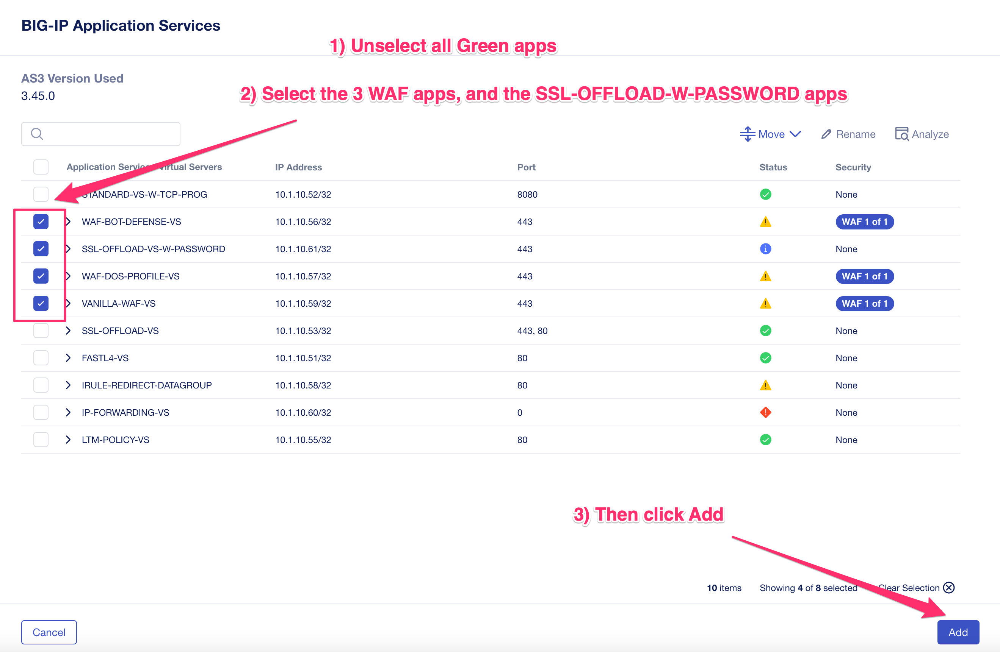

Confirm the summary of applications, and then click **Next**.

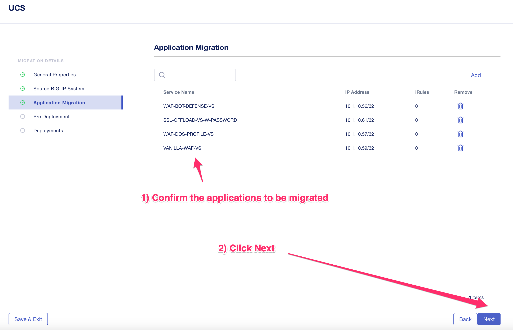

Review the shared objects either already imported, or that need to be imported by clicking on the nnumber under the *8Shared Objects** column. Then Import andny required shared objects. We will leave all Locations as **Save as Draft**, meaning they will be staged so that changes can be made, but not actually migrated yet. Click **Deploy** to stage the draft changes.

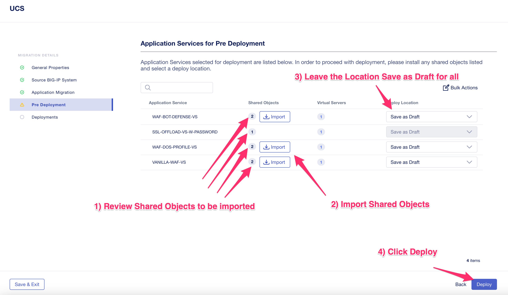

Here, you can see the apps that are in Draft status as well as the applications that have been successfully mmigrated. Click **Finsih**.

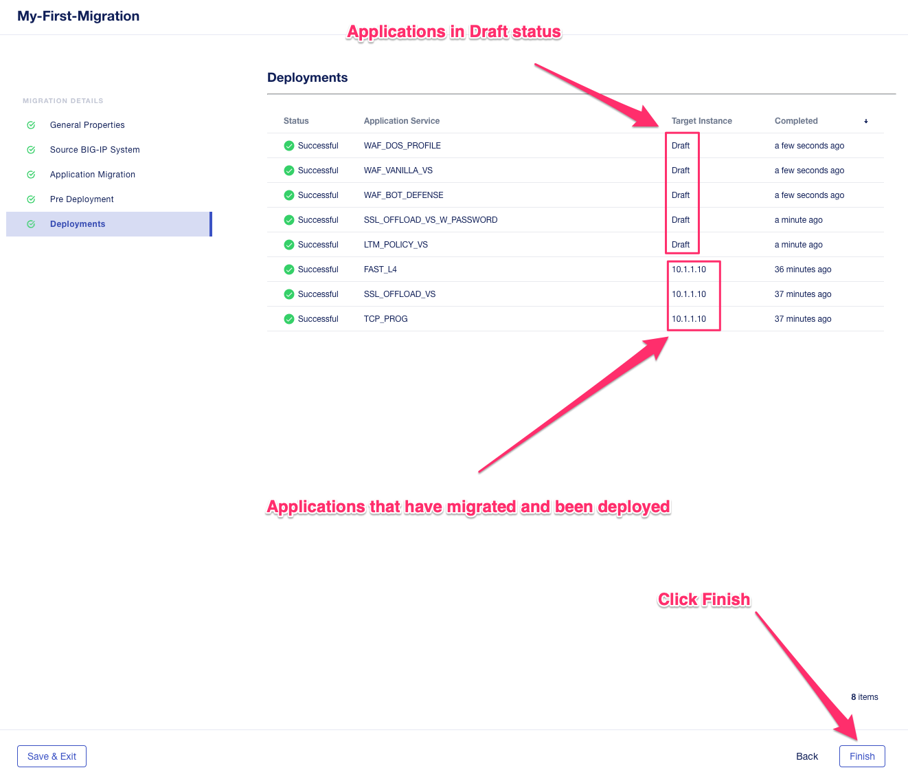

On the application dashboard you will now see both the migrated as well as the **Draft** applications.

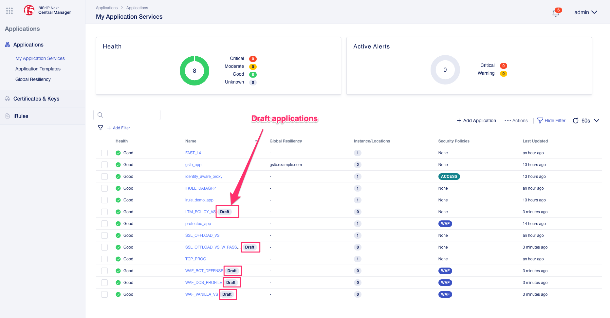

Click on the Draft application WAF-DOS-PROFILE-VS.

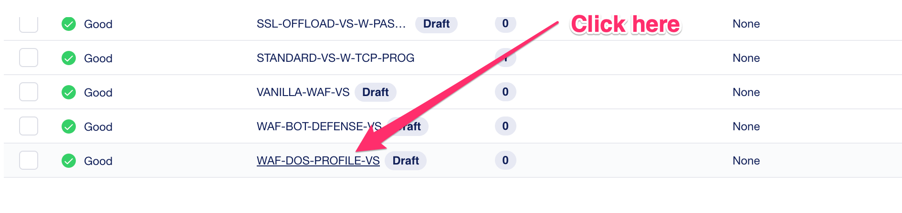

This will bring up the AS3 Declaration that is used to migrate the application. Note that here you can review the configuration that will be deployed to BIG-IP Next, and you could also make edits (Don't do that now). As an exmaple, maybe you want to change the Virtual server address before migrating, you could do that here if needed. For now just review the application take note of the virtual server address, and then click the **Save and Deploy** button.

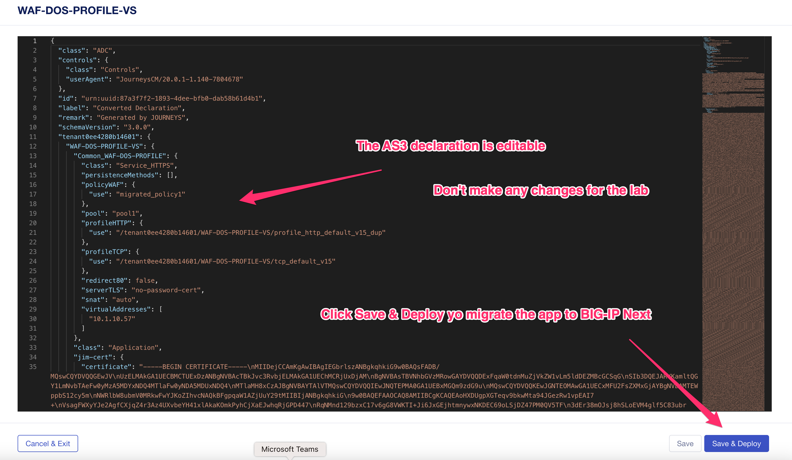

You'll then be prompted for a deploy location. Select 10.1.1.10 and select **Yes, Deploy**. NOTE: An enhancement has been filed to provide hostnames of the BIG-IP Next instances instead of IP addresses.

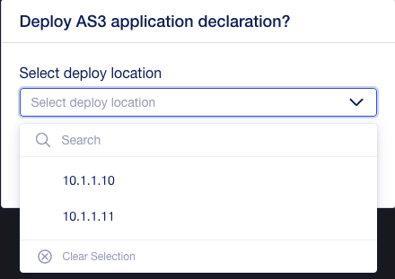

Repeat this process for each WAF application you saved as a Draft. Do not migrate the SSL OFFLOAD app yet.

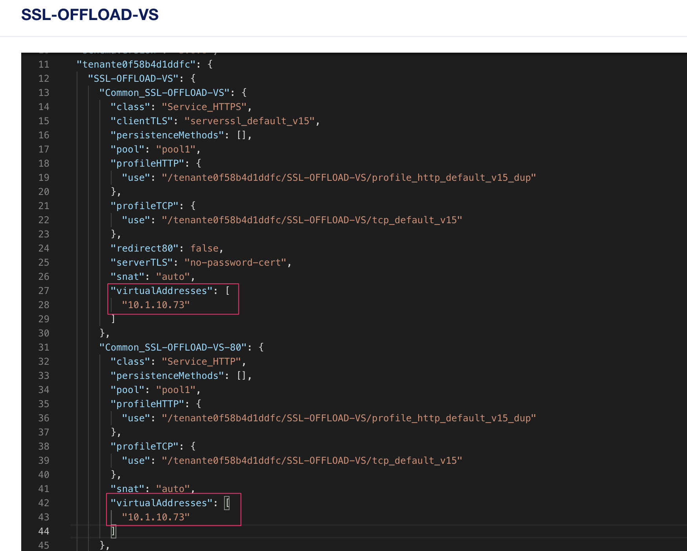

Now test that the WAF applications have been migrated over to BIG-IP Next. From the Windows jumphost, open a Chrome browser window and then enter in the following to ensre you reach the back-end application.

- Vanilla WAF - https://10.1.10.59
- DOS WAF - https://10.1.10.57
- BOT WAF - https://10.1.10.56

After acceptring the security/certifcate warning you should see the Next Lab page in the browser indicating successfull connection to the app, and a successfull migration of the WAF apps to BIG-IP Next.

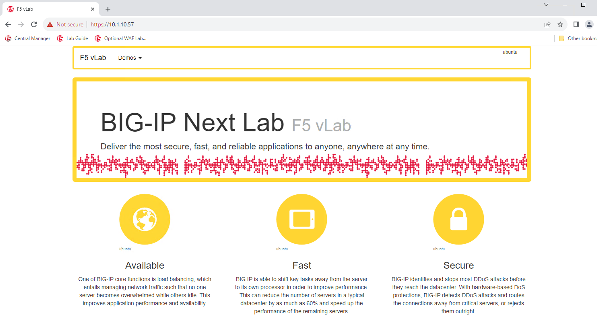

Lastly click on the SSL OFFLOAD Draft application and review the AS3 declaration. Note that the certs and keys that are pasword protected are not currently migrated automatically. You would need to add thos certs and keys manually. This is being addressed in a subsequnt release.

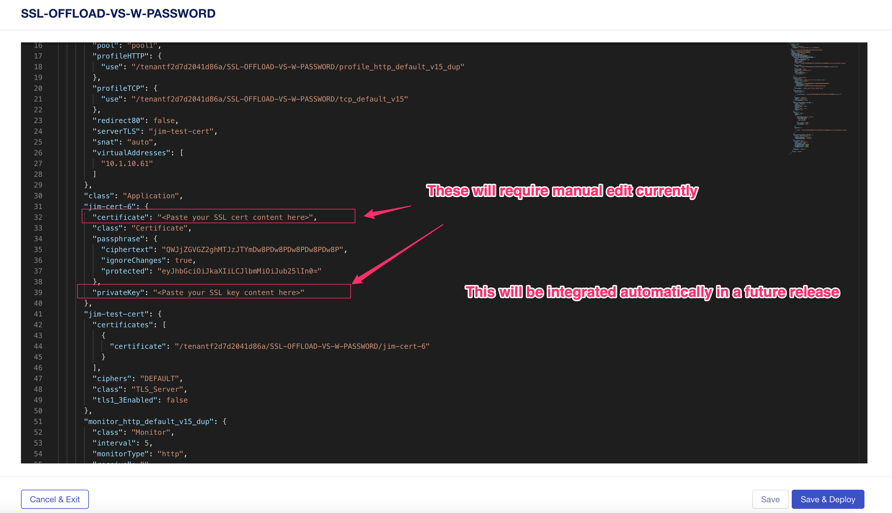

This complete the migration lab.

