..  Author: Tami Skelton 09/15/2022

===============================================================================
How to: Create a BIG-IP Next HA instance on VE from BIG-IP Next Central Manager
===============================================================================

Overview
========
A BIG-IP Next HA instance consists of an active and a standby node. Create a BIG-IP Next HA instance to safe-guard your applications and traffic in the event there is an issue with the provider the BIG-IP Next is installed on. In such an event, the active node in your BIG-IP Next HA instance will failover to the standby node with no disruption to current traffic or applications.

Prerequisites
=============
Before you can create a BIG-IP Next HA instance, you must have two standalone instances already onboarded to BIG-IP Next Central Manager. Refer to `How to: Onboard BIG-IP Next (GUI) <../configure_new_big_ip_ma_instance>`_ for details.

- Two standalone BIG-IP Next instances running the same software version in the same provider (VE) and in a healthy state.
- A license for the BIG-IP Next instance you want to designate as the active node.
- Between five and seven self IP addresses that are not assigned anywhere else in your network
- Traffic VLANS - One IP address for each BIG-IP Next instance, plus a floating IP address
- Control Plane HA VLAN - One IP address for each BIG-IP Next instance (by default, this VLAN will use two additional IP addresses on the management network, but you have the option to create a separate VLAN)
- Data Plane HA VLAN - One IP address for each BIG-IP Next instance

---------
Procedure
---------
#. Add a second BIG-IP Next instance to your infrastructure
.. image:: lab6_img01_add_second_instance.png
   :scale: 25%
#. Follow procedure that was used to onboard initial device with instance 2. Upon completion you should have four total instances as shown in below screenshot.

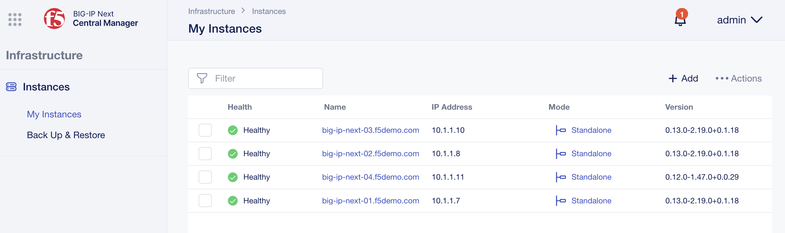
#. Click the mode link (the word "Standalone" under the "Mode" column) of the standalone BIG-IP Next instance (big-ip-next-01.f5demo.com) you want to become the active node in the BIG-IP Next HA instance.

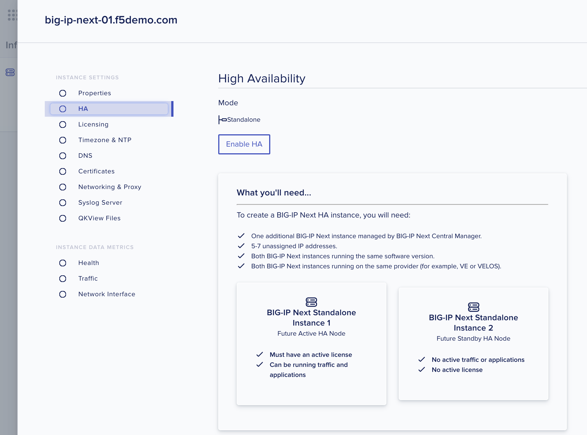

   The High Availability panel opens.

#. Click the **Enable HA** button.

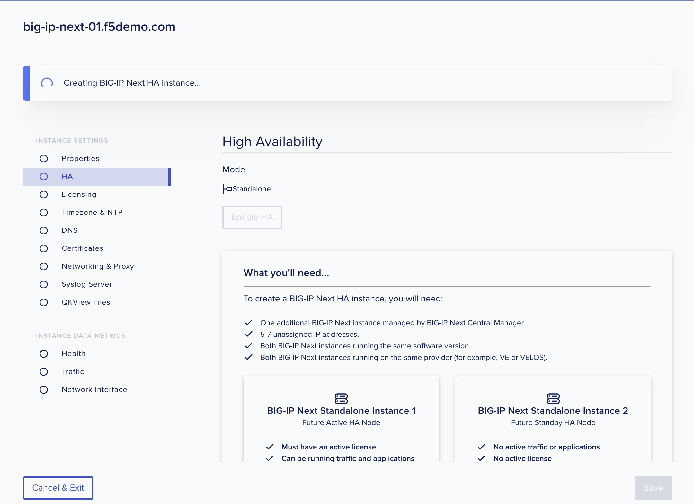

   The HA Nodes panel opens.

#. The name and IP address for the BIG-IP Next instance that you selected displays.

   This will be the active node in the BIG-IP Next HA instance after it’s created.

#. From the **Available Standby Instances** list, select the BIG-IP Next instance (big-ip-next-02) you want to designate as the standby node in the BIG-IP Next HA instance, and click the **Next** button.

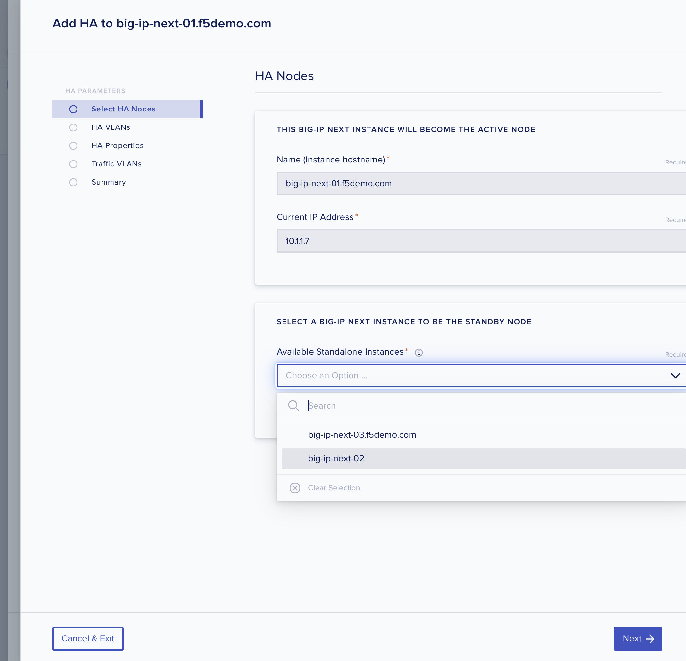

   BIG-IP Next Central Manager displays only BIG-IP Next instances that meet the requirements to be a standby node. That is, only healthy BIG-IP Next instances running the same software version as the future active node on the same provider (VE).

#. From the **Control Plane VLAN** list, you'll need to create a new Control Plane VLAN for this BIG-IP Next HA instance by clicking the **Create VLAN** link. 

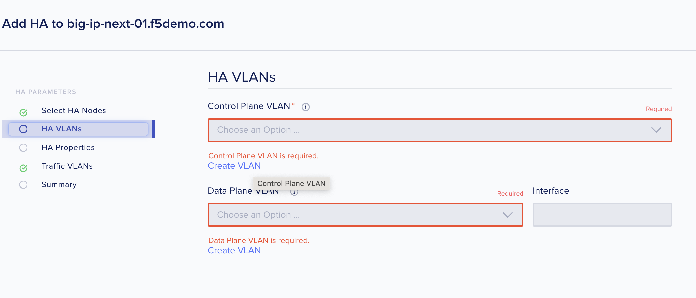

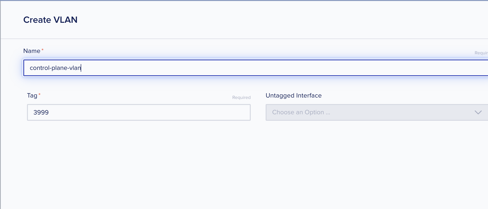

#. From the **Data Plane VLAN** list for this BIG-IP Next HA instance, you'll need to create a new Data Plane VLAN by clicking the **Create VLAN** link.

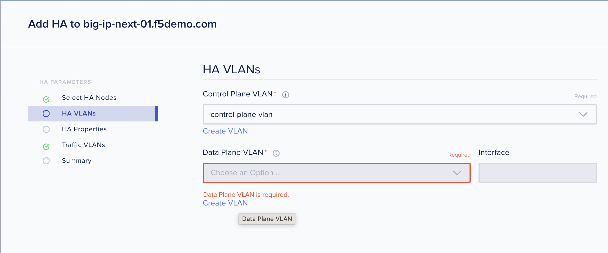

.. image:: lab6_img09_add_ha_create_dataplane_vlan.png
   :scale: 25%

#. After you select the VLANs, click the **Next** button.

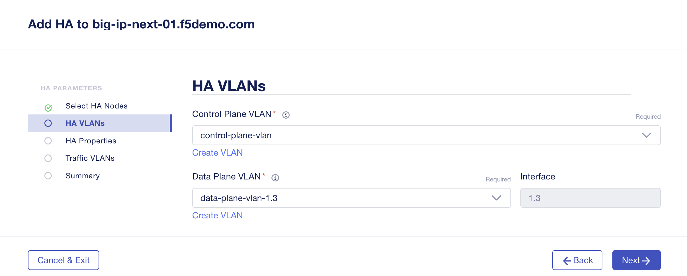

   The HA Properties panel opens.

#. Enter the **HA Name** (example: ha1) for this high availability pair of nodes. This name should be unique for each pair managed by the Next Central Manager instance.

#. Enter the **HA Management (Floating) IP Address** (should be 10.1.1.9) for use when failing over to the standby node.

#. Enter the **Control Plane** and **Data Plane IP** addresses that the active and standby nodes use for communication with each other. (See screenshot for suggested IP addresses)

   The CIDR must be unique for each IP address and must use the same interface.

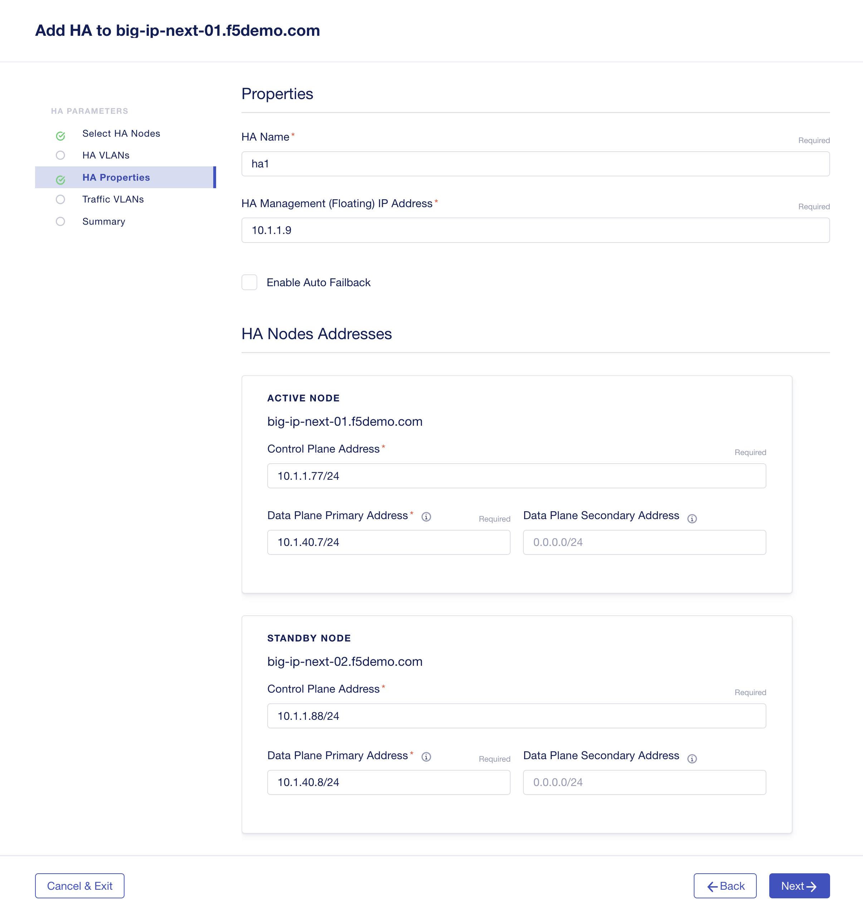

#. Click **Next**.

   The Traffic VLANs panel opens and displays the VLANs you specified for traffic.

.. image:: lab6_img12_traffic_vlans_unconfigured.png
   :scale: 25%

   You can have only one IP address for each active and standby node, but you can add additional floating IP addresses by clicking on the VLAN name.
#. Click each VLAN to open a panel to add the respective Active, Standby, and Floating IP addresses.

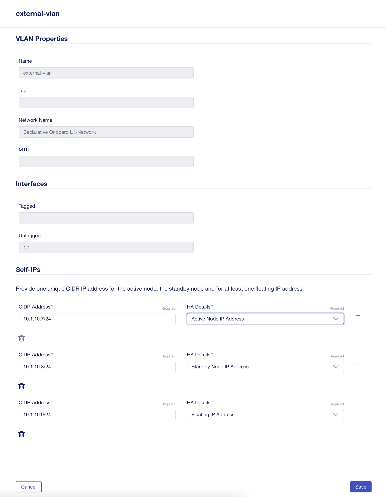

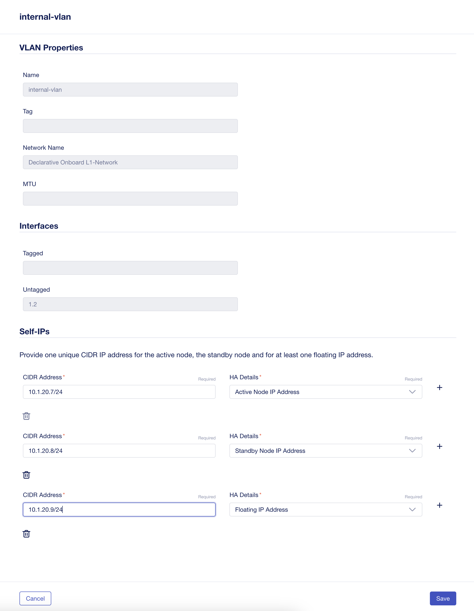

   When each VLAN displays a green check mark, you can proceed.

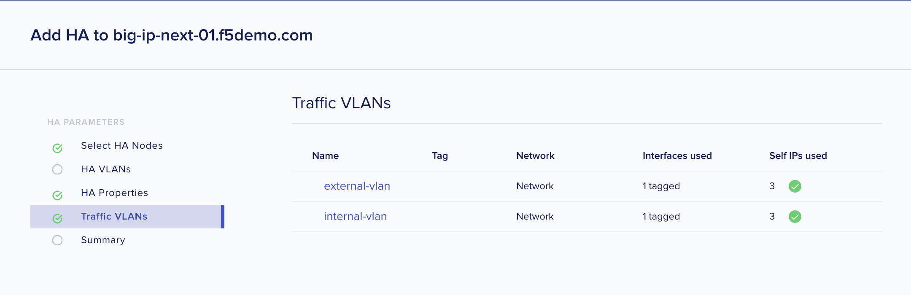

#. Click **Next**.
   The Summary screen opens to display the BIG-IP Next HA configuration you specified.

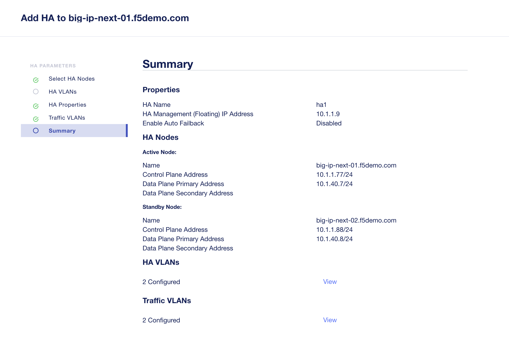

#. Click **Deploy to HA**.
   You'll be prompted to confirm the deployment.

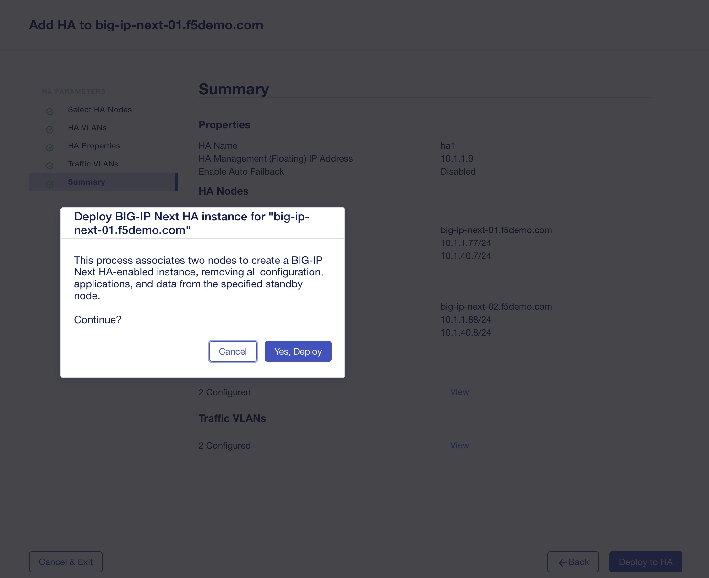

   Click **Yes, Deploy**

#. Assuming a successful deployment, you'll see the properties of the HA instance you just created.

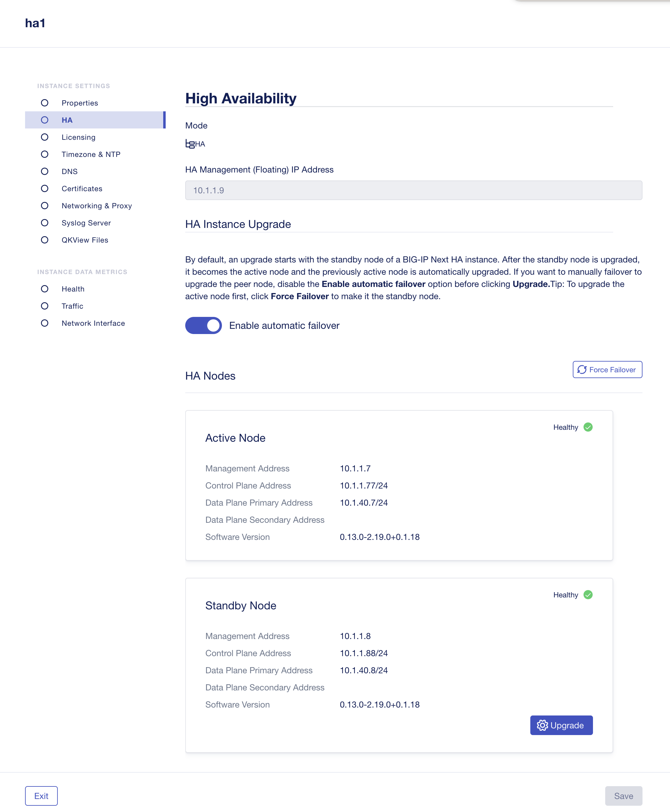

#. Click **Exit** and you'll be returned to your My Instances list and you'll see that you now have an instance of type HA under the "Mode" column.

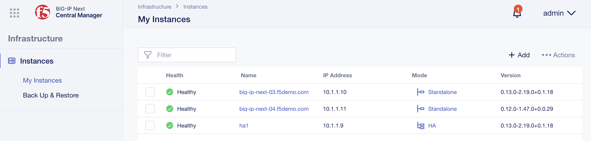

------
Result
------
BIG-IP Next Central Manager converts the standalone BIG-IP Next instance to a BIG-IP Next HA instance.

